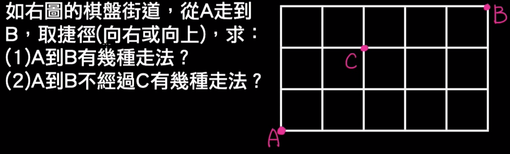
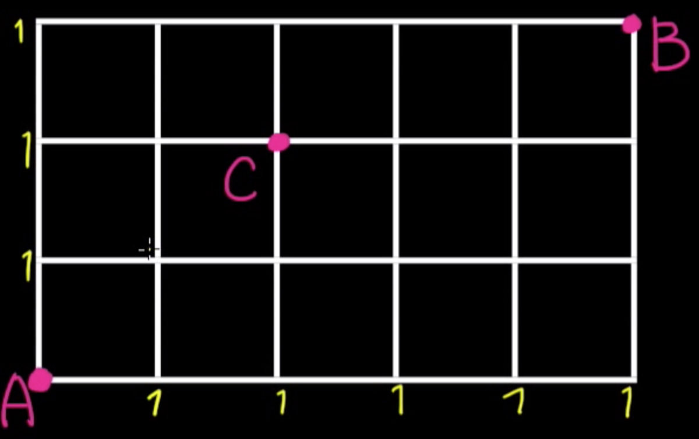
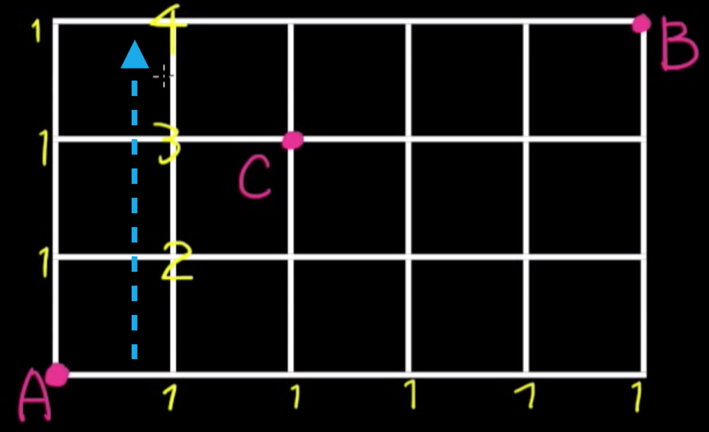
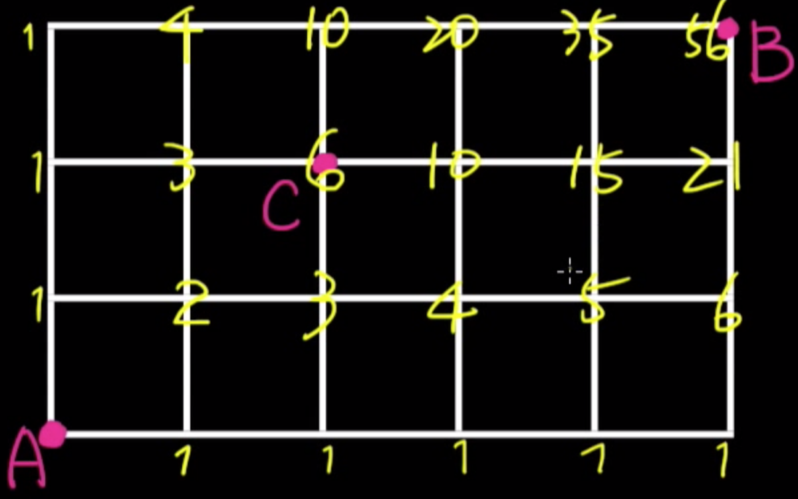

# Dynamic Programming

Dynamic Programing 這個名字其實沒有特別的意義。提出這個作法的人表示：

> He (boss of the Air Force) was Secretary of Defense, and he actually had a pathological fear and hatred of the word, research. ... I felt I had to do something to shield Wilson and the Air Force from the fact that I was really doing mathematics inside the RAND Corporation. What title, what name, could I choose? In the first place I was interested in planning, in decision making, in thinking. But planning, is not a good word for various reasons. I decided therefore to use the word, ‘programming.’

所以這個名字其實只是一個想要拿到預算的人為了說服長官想出來的一個酷炫的名字。動態規劃是一個「用空間換取時間」的步驟。

## 走格子

其實高中就教過動態規劃解題目，只是那時候沒有說這叫動態規劃。這個例子是這樣：



如果知道作法的話，可能會直接用 $8!/(3!5!)$ 來算。不過，除了這個作法之外，一定有看過像這樣的作法：考慮每一個點可能的「來源」。首先，對於「只有向上」跟「只有向右」的那些點，因為規定「只能向右」跟「只能向上」走，所以他們唯一的點，就是從左邊或下面來：



接著，考慮所有「只向右走一步」的所有點：他們的來源，只可能是下面或左邊，因此可以知道：



以此類推，可以畫出如下面的圖：



 這樣就可以逐漸建構出到 $B$ 需要步驟數目。

### 分析

上面這個步驟實際上是這樣：假定 $A[i][j]$ 是從原點到位於 $(i, j)$ 點的方法數，則：
$$
A[i][j] = \begin{cases}
0 & \text{if }i = j = 0 \newline
A[i - 1][j] & \text{if }j = 0 \text{ or } j = 3\newline
A[i][j - 1] & \text{if }i = 0 \text{ or } i = 5\newline
A[i - 1][j] + A[i - 1][j] & \text{if }i, j > 1\newline
\end{cases}
$$
但是，有這個遞迴關係還不夠，還要有一個聰明的計算順序。設想這個問題如果從最中間的點開始計算，就不知道要怎麼計算了。

## Coin Change

==Input==：$m$ 種面額的硬幣，第 `i` 個硬幣的價值是 `v[i]`。一個表示想換錢的整數 `N`

==Output==：一個整數 `k`，表示最少要用少數目的硬幣湊到 `N` 塊錢

仿照剛剛的作法，思考 `N` 塊錢可能的「來源」有哪些。
$$
S[n] = \min_{\begin{align}i \in 0 \dots m\newline \ N - v[i] > 0\end{align}} ( S[n - v[i] ] + 1)
$$
不過，這還有一個邊界條件，就是 $S[0] = 0$，所以其實應該要改寫成：
$$
S[n] = 
\begin{cases}
0 & \text{if }n = 0\newline
\min_{\begin{align}i \in 0 \dots m\newline \ N - v[i] > 0\end{align}} ( S[n - v[i] ] + 1) & \text{otherwise}
\end{cases}
$$
因此：

```c
for (int i = 0; i < n; i++)
    for (int j = 0; j < m; j++)
        if (i - v[j] >= 0)
            A[i] = min (A[i], A[i - v[j]] + 1);
```

## LIS

==Input==：一個 `N` 個元素陣列 `A`

==Output==：一個 `A` 的子序列，且該子序列為嚴格遞增

這個東西有 $O(n^2)$ 跟 $O(n\lg n)$ 的解法。解這個問題的其中一個方法是問「如果 `A[i]` 是這個遞增序列中的一員，那麼他的前一個元素可能是誰？」類似第，定義：
$$
S[n]：\text{「前 0 ... n 個元素」這個元素的最長遞增子序列}
$$
因此：
$$
S[n] = \max_{\begin{align}A[i] < A[n]\newline \text{where } i < n\end{align}}(S[i] + 1)
$$
所以程式就是：

```c
int S[N + 1] = {0}; 
int pi[N + 1] = {0}; 
for (int n = 0; n < N; n++)
    for (int i = 0; i < n; i++)
        if (A[i] < A[n]) {
            S[n] = max (S[i] + 1, S[n]);
            pi[n] = i;
        }
```

觀察迴圈次數可以知道複雜度是 $O(n^2)​$。

另外一個 $O(n\lg n)$ 的解法叫做 Robinson-Schensted-Knuth Algorithm，概念是這樣：思考 `A[i]` 可能是 LIS 中的第幾個元素：

```c
vector <int> LIS;
LIS.push_back(s[0]);	//space to store answer
for (int i = 1; i < N; ++i)
    if (A[i] > LIS.back())
        LIS.push_back(A[i]);
    else
        *lower_bound(LIS.begin(), LIS.end(), A[i]) = A[i];
```

這時 LIS 裡面存的就是一個遞增子序列，計算長度即可得。

## Matrix Multiplication

==輸入==：一個合法的矩陣連乘表示式 $A_1A_2 \dots A_n​$。

==輸出==：一個可以讓乘法步驟最小的乘法順序。

這個作法是這樣：觀察「上一個乘法發生在裡」。以 5 個矩陣連乘為例，令城出來的矩陣叫做 $A_1 A_2 A_3 A_4 A_5$  。那麼，用括號表示的話，最後一個乘法發生的位置可能在：
$$
\begin{align}
(A_1)(A_2A_3A_4A_5)\newline
(A_1 A_2)( A_3 A_4 A_5) \newline
(A_1 A_2 A_3)( A_4 A_5)\newline
(A_1 A_2 A_3 A_4) (A_5)
\end{align}
$$
假定 `M[i][j]` 是第 `i` 個矩陣連乘到第 `j` 個矩陣中，乘法次數最小的次數，那麼：
$$
M[i][j] = \min_{0 < k < j}\{M[i][k] + M[k + 1][j] + row[i]\cdot col[k]\cdot col[j]\}
$$
最後找 $M[1][N]$ ，其中 $N$ 是陣列個數。

## LCS

==輸入==：A 跟 B 兩個字串。

==輸出==：A 跟 B 的最長子序列。

假設現在有「 $A[0]$ 到 $A[i]$」與 「$B[0]$ 到 $B[j]$ 」這兩個字串的最長子序列（姑且稱這個字串叫 $S$）那麼：

1. 假定 $A[i + 1] = B[j + 1]$：最長子序列就是 $S + A[i + 1]$。
2. 假定 $A[i + 1] \neq B[i + 1]$：那兩者的最長子字串就仍然是 $S$。

而邊界條件是：空字串跟所有字串的子字串都是空字串。

## OBST

==輸入==：一個由小大的序列 $A[1] \dots A[N]$，以及權重 $p[1] \dots p[N]$ ，其中 $p[i]$ 表示搜尋 $A[i]$ 的權重。以及 $q[0] \dots q[N]$ 表示搜尋「不是 $A$ 序列點中的值」的權重。其中，若 $q[0]$ 表示「搜尋的值比 $A[1]$ 小的權重」; 而 $q[N]$ 表示「搜尋值比 $A[N]$ 大」的權重，而對於 $1 \leq i < N$，$q[i]$ 表示「$A[i]<$ 搜尋值 $< A[i + 1]$ 的權重」。

==輸出==：一顆二元樹 $T$，使得「搜尋深度的加權值」，即：
$$
\sum_{i = 1}^{N}d(A[i])\cdot p[i] + \sum_{i = 0}^{N}d(B[i])\cdot q[i]
$$
最小。

考慮一個 $A[i] \dots A[r - 1]$ 形成的二元搜尋樹 $T_L$，跟 $A[r + 1] \dots A[j]$ 形成的二元搜尋樹 $T_R$。對於裡面的樹，加權平均是：
$$
E_L = \sum_{k = i}^{r - 1}d(A[k]) \cdot p[k] + \sum_{k = i - 1}^{r}d(B[k])\cdot q[k]
$$
以及：
$$
E_R = \sum_{k = r + 1}^{j}d(A[k]) \cdot p[k] + \sum_{k = r}^{j}d(B[k])\cdot q[k]
$$
兩棵樹合併時，所有人的深度都會 + 1，這時期望值是：
$$
E = p[r] + \sum_{k = i}^{r - 1}(d(A[k]) + 1) \cdot p[k] + \sum_{k = i - 1}^{r}(d(B[k]) + 1)\cdot q[k] +\sum_{k = r + 1}^{j}(d(A[k]) + 1) \cdot p[k] + \sum_{k = r}^{j}(d(B[k]) + 1)\cdot q[k]
$$
稍微化簡一下：
$$
E = \left(\sum_{k = i}^{j}p[k] + \sum_{k = i - 1}^{j}q[k]\right) + E_L + E_R
$$
邊界條件是空樹（也就是區間不包含任何 $A$ 中的元素）期望值為 0。

## TSP

