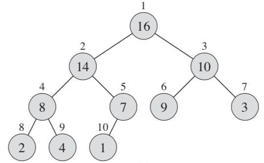

# Heap

一顆 Complete 的二元樹。

# 基本觀察 1：二元數的節點數目

假定把一顆 Complete 的二元樹由根開始，由上(根部)往下，由右而左編號，如下圖：



假定 `i` 是某一個節點的編號，則該節點的左、右子節點的編號，分別用 `left(i)` 與 `right(i)` 表示，為：
$$
\begin{cases}
\mathtt{left(i) = 2*i} \newline
\mathtt{right(i) = 2*i + 1}
\end{cases}
$$

---

爆開計數就好。、假定某一個節點位於第 $j$ 層，的第 $k$ 個，則該節點的編號為：

$$
i = (2^{j-1}-1) + k
$$
若某一個節點編號為 $i' = (2^{j' - 1} -1) + k'$，則該節點的左子節點與右子節點編號分別為：
$$
\begin{cases}
i_L = (2^{j'} -1) + 2k' - 1 &= 2i' \newline
i_R = (2^{j'} -1) + 2k' &= 2i' + 1
\end{cases}
$$

這裡有一個小技巧：找出第 $i$ 個節點的二進位形式。可以觀察到：第一層有 $2^0$ 個節點，第 1 層有 $2^1$ 個節點 ... 第 $i$ 層有 $2^i​$ 個節點。因此，幫二元數編號這件事，本質上就跟找二進位表示是一樣的。

---

# 基本觀察 2：父節點的編號

假定依照上述過程編號，並且某個節點的編號為 $i \geq 2$，則該節點的父節點為：
$$
\mathtt{parent(i) = i/2}
$$

上面觀察的直接結論。

---

# 基本觀察 3：根的左右都是 Heap

假定現在有一個 Heap，那麼這個「Heap 的左右子樹都是 Heap」。這件事在之後的操作中很有用處，因為只要沿著這個構造就可以進行遞迴操作。

要注意的是「把一個節點連接到兩個 Heap 的根」並不保證做出來的東西是個 Heap。因為有可能兩個 Heap 都不是全滿的，這時做出來的東西就不是 Heap。

# Def (Binary Heap)

$$
\text{A binary heap is a complete binary tree}
$$

其實就是教科書上常常看到的那個樣子。

---

這個資料就只是把一堆東西編號起來，想像他是一顆 Complete 的樹的樣子。但真正讓這東西有用處的地方，是規定一些父子節點間必須滿足的規則。比如說：

# Def (Max Heap)

假定一個 Heap 滿足：

1. 是一個 Binary Heap
2. 對於所有節點，`HEAP[parent(i)] >= HEAP[i] 

那麼就稱這個 Heap 叫做 Max Heap。

這個 Heap 有一些觀察：首先是「左右子節點都比父節點小」。考慮根節點，他的左右子節點必定比他小，而他左右子結點的子節點也會比他小 ... 一直遞迴下去的話，可以推論「所有子節點都比跟節點小」。

另外，補充一個小插曲：乍看之下可以用這個性質去遞迴定義 Heap，但實際上沒有這麼簡單：因為合併兩個 Heap 時沒辦法保證全滿。但這個性質在建 Heap 時會幫我們找到 $O(n)$ 的演算法。

# 兩種運算

Binary Heap 的操作有建立、插入、刪除 … 等等。但這些操作都建立在兩種基本的運算上，這邊稱作 `PUSH_DOWN` 跟 `PUSH_UP`。

## Push Down

這個運算的發生時機是「只有根節點不滿足 Max Heap 性質」時，可以做的修正動作。這件事情的作法是這樣：

1. 比較根節點、左子節點、右子節點中最大的。如果發現最大的是根節點，那麼因為左右都是 Max Heap，所以整個東西就自動事 Heap
2. 如果最大的不是根節點，就把根節點跟最大的那個調換位置。這時原先的根節點會在本來的子節點的位置。
3. 以下面那個子節點為根，做 `PUSH_DOWN`

```pseudocode
PUSH_DOWN(A, i):
	greatest = i
	l = left(i)
	r = right(i)
	if (left(i) < A.size && GREATOR(A[l], A[greatest])):
		greatest = l
	if (right(i) < A.size && GREATOR(A[r], A[greatest])):
		greatest = r
	if (greatest != i):
		SWAP(A[greatest], A[i])
		HEAPIFY(A, greatest)
```

因為每次都把東西往下推一層，最差狀況就是從第一層推到最下面那層，所以複雜度就是樹高，也就是 $O(\lg n)$。

這個操作使用的一個情境是：假設把某個的值變小，這時候兩個子結點就有可能要上位，因此

## Push Up

這是跟上面相反的狀況：假設


```pseudocode
PUSH_UP (A, i):
	while (i > 1)  && (A[parent(i)] < A[i]):
		SWAP (A[i], A[parent(i)])
		i = parent(i)
```

這種狀況比如說用在「把一個已經維持好的 Heap，增加節點 `i` 的值」。

# Build Heap

因為已經知道左右子樹都滿足 Heap 性質時，要怎麼樣把這個東西修正成 Heap，因此可以 Bottom Up 的把整堆陣列修正成 Heap 的方法：

```pseudocode
BUILD_HEAP (A)
	for i in A.size to A.size/2:
		PUSH_DOWN(i)
```

乍看之下複雜度會以為是 $O(n \lg n)$，但其實是 $O(n)$。

# Insert

Insert 可以想像成「把節點加在最後面，然後一路向上推」。所以就是：

```
MAX_HEAP_INSERT (A, val, size):
	A[size] = val;
	PUSH_UP(A, size);
```

# Heap Sort


## Reference

1. CLRS，