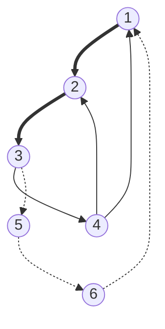
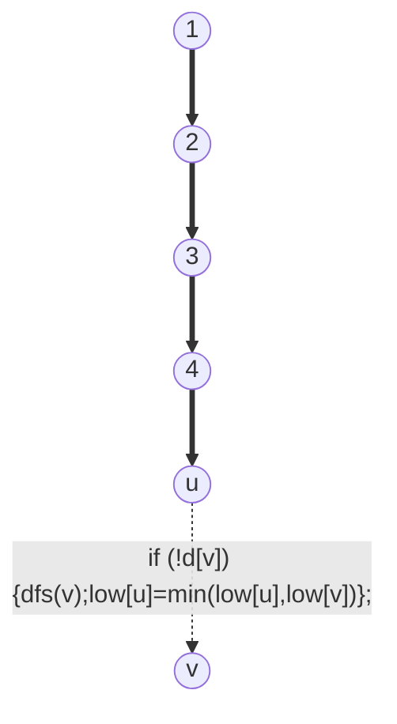
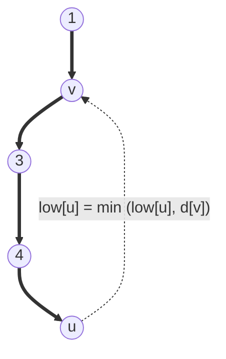

# Tarjan's SCC Algorithm

這是另外一個 SCC 的演算法，複雜度也是 $\Theta(E + V)$，但比較優化的地方是只要一次 DFS，而且不用把圖逆向，所以步驟可以更加簡化。

## Basic Concepts

找 SCC 的關鍵是找到環，而其中一種湊出環的方式，就是找 DFS Tree 的 back edge：只要在 DFS 過程中，發生「還沒遍歷完整顆樹時，就發現子節點可以走回母節點」，那根據樹的性質，就知道這個地方有環。所以，找到 back edge 指到的母節點，那麼就可以從 DFS 的 stack 中，往回追蹤出哪些點在同一個環上，他們就會在同一個 SCC。示意圖大致如下：



DFS 中，美出現一個「最早祖先是 `u` 的環」，就可以把這個環上所有點納進「以 `u` 為看頭的 SCC」中。

這邊的概念是這樣：

1. 每一個 SCC 都用「DFS 過程中，最早遇到的點作為標示」。以上圖為例，假定 DFS 從 `1` 開始，那麼就把

## Algorithm Design

首先思考一下基本款的 DFS：

```C++
void dfs(int root)
{
	vis[root] = 1;
    for (auto &i : G[root])
        if (!vis[i])
    		dfs(i);
}
```

現在想做的事情是找 back edge。而且，只發現了 back edge 還不夠，還希望找到的環盡可能大。也就是說，要找到「可以找到的最前面的父節點」。

為了做到這點，先幫 DFS 做上時間標記。因此，將程式碼改寫如下：

```c++
int t = 0;
void ＿＿dfs(int u)
{
	enter[u] = ++t;
    for (auto &v : G[root])
        if (!enter[v])
    		dfs(v);
}

void dfs ()
{
	for (int i = 0; i < N; i++)
        if (!enter[i])
            __dfs(i);
}
```

這邊的 `enter` 陣列對應到 CLRS 中的 `v.d` 成員，即每個節點 DFS 的「開始時間」。這樣一來，就有一個比較先後順序的依據。為了方便，換成 CLRS 中的術語：

```c++
int t = 0;
void ＿＿dfs(int u)
{
	d[u] = ++t;
    for (auto &v : G[root])
        if (!d[v])
    		dfs(v);
}

void dfs ()
{
	for (int i = 0; i < N; i++)
        if (!d[i])
            __dfs(i);
}
```

這邊可以觀察一件事：如果 `d[u]` 是 0，表示這個節點根本還沒有被進入過(?)，對應 CLRS 術語就是「顏色為 `WHITE`」。

接下來的問題是：要找到「最前面的節點」。也就是說，假定現在 DFS 正在 `u`，準備往下一個節點 `v` 前進。這時 `v` 的狀況會有 3 種：

==第一種狀況==：假設 `u` 點的下一個點是還沒遍歷過的點（CLRS 術語：下一個點是 `WHITE`）。這時，對於點 `u` 來說，如果他的下一個點 `v` 可以比它到達更前面的地方，那麼 `u` 一定也可以到更前面的地方。所以：

```c++
void ＿＿dfs(int u)
{
	d[u] = ++t;
    for (auto &v : G[root])
        if (!d[v]) {
    		dfs(v);
            low[u] = min (low[u], low[v]);
        }
}
```



==第二種狀況==：假設 `u` 的下一個點現在正在 DFS 的 Stack 中（CLRS 的術語是：`u` 的顏色為 `GRAY`），那麼就可以知道這時後狀況是「`u` 往回連回 DFS 樹的某個地方」，像這樣：



這時候，`u` 可以到的最前面的地方，就是 `v`。所以現在狀況變成：

```c++
int t = 0;
void ＿＿dfs(int u)
{
	d[u] = ++t;
    low[u] = d[u];
    gray[u] = true;
    
    for (auto &v : G[root]) {
        if (!d[v]) {
    		dfs(v);
            low[u] = min(low[u], low[v]);
        } else if (gray[v]) {
        	low[u] = min (low[u], d[v]);
        }
    }
}

void dfs ()
{
	for (int i = 0; i < N; i++)
        if (!d[i])
            __dfs(i);
}
```

==第三種狀況==：不是上面 2 種狀況（在 CLRS 術語中是「`v` 的顏色為 `BLACK`」）。這時候 `v` 根本就是在另外一個已經 DFS 結束的分支上，所以根本走不回去。

```c++
int t = 0;
void ＿＿dfs(int u)
{
	d[u] = ++t;
    low[u] = d[u];
    instack[u] = true;
    
    for (auto &v : G[root]) { 
        if (!d[v])
    		dfs(v);
        low[v] = instack[u] ? min (low[u], low[v]) : low[v];
    }
    instack[u] = false;
}

void dfs ()
{
	for (int i = 0; i < N; i++)
        if (!d[i])
            __dfs(i);
}
```

這樣就找得到最前面的祖先了。不過這邊的問題並不是找到最前面那個祖先，而是找到「當這條 back edge 連回去到同一一個祖先，形成一個環時，環上面所有的點是哪些」。也就是說，當發現 back edge 時。這時可以觀察一件事：那個被 back edge 連回去的點 `v`，有 `low[v] == enter[v]`。因為他的子結點的 `low` 值都會跟他一樣，直到他為止。不過，這表示另外記錄

```c++
int t = 0;
stack <int> s;
void ＿＿dfs(int u)
{
	d[u] = ++t;
    low[u] = d[u];
    gray[u] = true;
    s.push(u);
    
    for (auto &v : G[root]) { 
        if (!d[v])
    		dfs(v);
        low[v] = gray[u] ? min (low[u], low[v]) : low[v];
    }
    
    if (low[u] == d[u]) {
        int top;
        do{
            top = s.top();
            s.pop();
            scc[top] = cnt;
            gray[u] = false;
        } while (low[top] != d[top])
        cnt++;
    }
}

void dfs ()
{
	for (int i = 0; i < N; i++)
        if (!d[i])
            __dfs(i);
}
```

