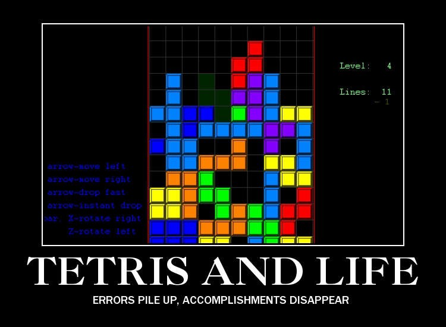
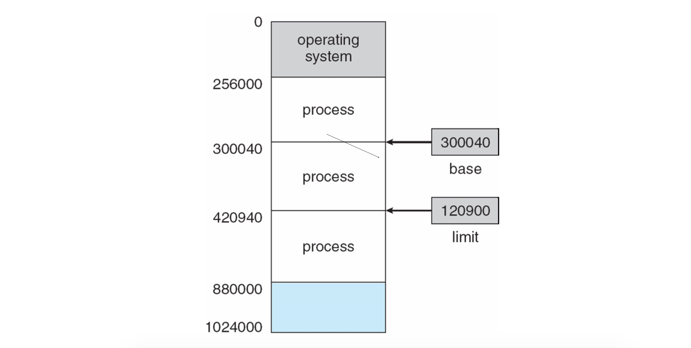
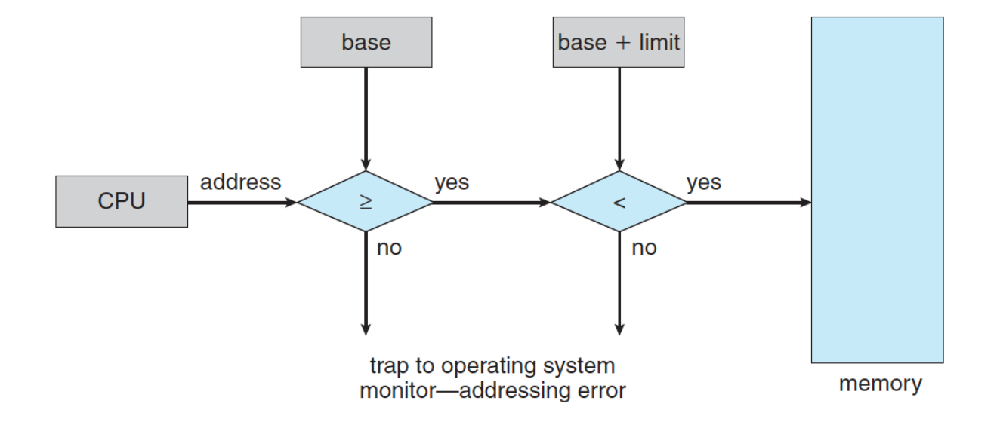
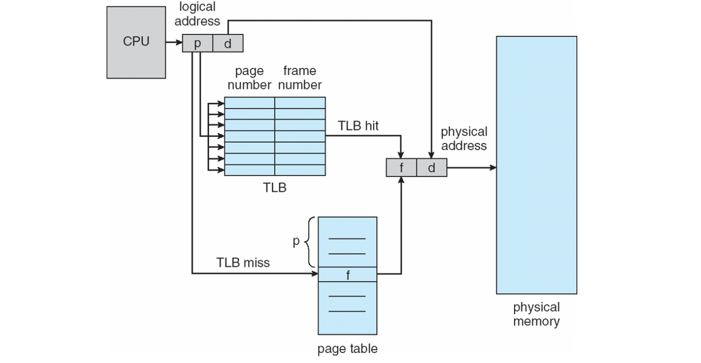

# Memory Management

(當 Fragmentation 太嚴重時，記憶體的狀態大概就像這樣)

# 前言

在寫程式時，都會把記憶體想像成一個「連續」的空間，程式資料都依照順序儲存在這個連續的空間中。像配置一個記憶體空間就會 `push %r1` ，資料就會自動塞進 stack 的最頂層等等。

這樣的想像聽起來很方便，至少存取資料不用作各種複雜的計算。但問題是：如果真的所有的程式都連續地塞在實體記憶體中，就有可能發生像上面俄羅斯方塊的狀況：明明有足夠的空間，但就是沒辦法全部塞下去。

# Process Memory Layout

[可執行檔在做什麼](https://lwn.net/Articles/631631/)

[怎麼把東西找出來](http://www.cs.bilkent.edu.tr/~korpe/courses/cs342fall2018/internal/project3-partB.pdf)

# 直覺的作法

## 簡單的作法

要滿足上面這種「記憶體是連續」的想像，最直覺的方式就是：在實體的記憶體中，安排一段連續的記憶體給每個程式。然後 CPU 做什麼，就對記憶體裡面的東西做什麼。這個實作感覺也不難，只要知道記錄「開始」跟「結尾」在哪邊就可以了：

這樣也可以提供一些保護：比如說可以比較即將存取的位址有沒有在 `base` 跟 `base + limit` 之間，如果沒有的話，表示存取越界，所以不應該給他存取：

至於要怎麼把東西塞進去呢？比如說可以

## Segmentation

剛剛的定址方法是用加的，另外一種方法是這樣：
$$
\mathtt{Physcal\ Address = (Segment\ Selector )*16+Offset}
$$
這個用法在 x86 真實模式時會用到。

## Paging

解法就是把記憶體分成固定單位，比如說 4KB 為單位，

但這樣另外一個問題是 Page Table 本身也需要使用記憶體，分得太多，會有大量記憶體用在 Page Table 上; 分得太少，又會浪費太多空間。

## Multilevel Paging

一個樹的概念。[LWN 的介紹](https://lwn.net/Articles/717293/)。

# 關鍵觀察：Locality

上面的東西都是一次把東西塞進記憶體中。

# 保持想像

# Reference

1. [CS 342 Operating Systems - Fall 2018](http://www.cs.bilkent.edu.tr/~korpe/courses/cs342fall2018/)