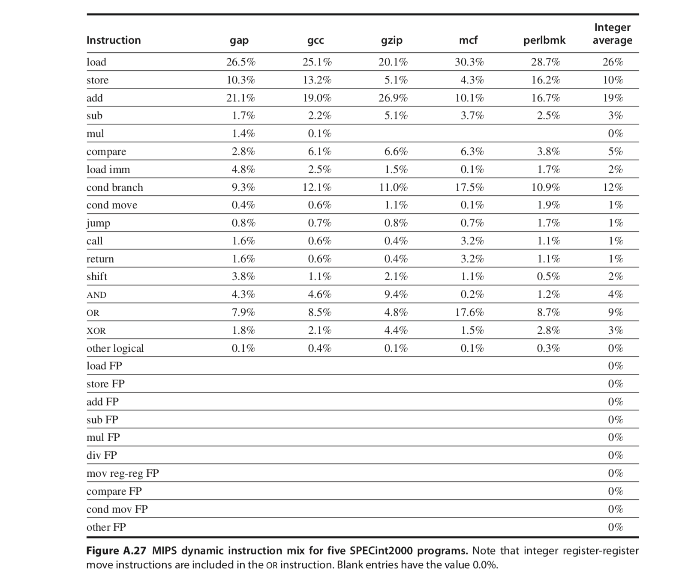
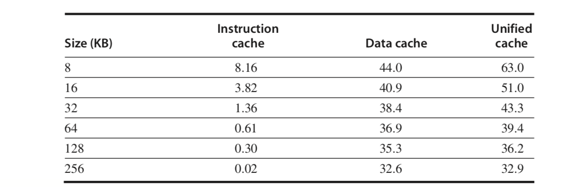
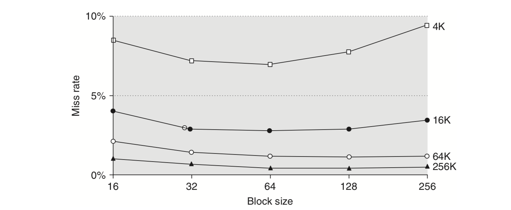
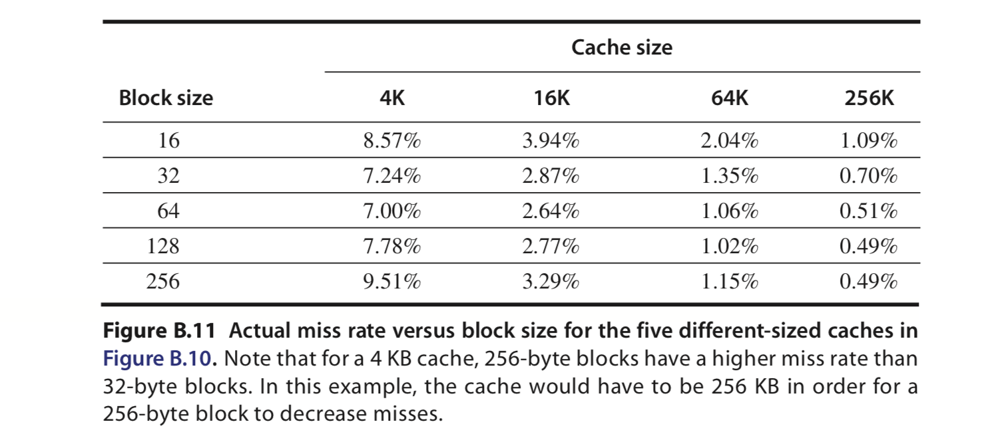
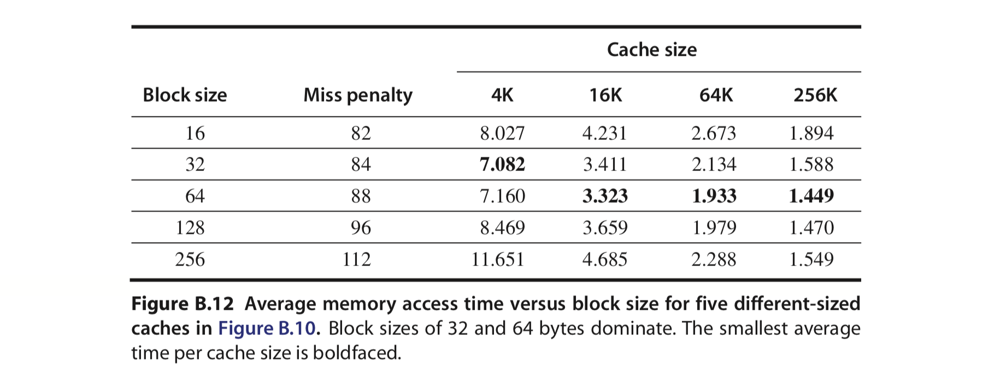

# Memory Part 2 - 優化

用數手指頭的方式猜測不同的 Cache 設計有大致上的表現如何。

這件事情的教科書版本通常會是這樣估計：

首先，會猜程式中有多少比例的指令牽扯 Load / Store。這邊需要注意的是：除了資料存取之外，指令也需要從記憶體存取。因此兩個需要一起考慮。接著考慮不同架構下，Cache Miss 的比率與代價，然後計算一下不同的設計之間的差異如何。

當然，這件事情有點怪的地方是：如果程式的功能很不同（比如說使用文字編輯器 vs. 剪影片），後面使用記憶體的方式可能大不相同，怎麼能放在一起比較？所以要注意的是這只是很粗略的估算。~~實際上叫他去含我的 `perf` 啦~~。

# 簡單的機率

假設現在某個指令要存取記憶體，那會有 2 種狀況：1) 他在 Cache 裡，謝天謝地 2) 他不在 Cache 裡，這時候就會有一堆 Cache Miss 的代價，比如說要去更下層的地方挖東西出來等等等。也就是說，除了執行這個指令，還要有一堆額外的動作把東西拿出來。假設現在我現在知道一個跟記憶體存取有關的指令在一切順利，沒有任何 Cache Miss 的駐礦下，需要 $T_{\text{necessary}}$ 的時間執行; 但如果有 Cache Miss 的話，需要多花 $T_{\text{miss}}$ 的時間處理記憶體相關動作，而假設知道 Cache Miss 的機率是 $P_\text{miss}​$，那麼時間的期望值會是：
$$
E(T) = (1 - P_\text{miss}) \cdot T_\text{necessary} + P_\text{miss} \cdot (T_\text{necessary} + T_\text{miss})
$$
不過，不管成功或失敗，一個指令至少都需要花 $T_{exec}​$ 的時間做每個指令都會需要做的事。這也是把上面這條東西展開來化簡會發生的事，你會得到：
$$
E(T) =T_\text{necessary} + P_\text{miss} \cdot T_\text{miss}
$$
不過，大家不喜歡數學，所以這邊每一項都幫他們取了名字：
$$
\underbrace{E(T)}_{\text{Average Memory Access Time}} = \underbrace{T_\text{necessary}}_{\text{Hit Time}} + \underbrace{P_\text{miss}}_{\text{Miss Rate}} \cdot \underbrace{T_\text{miss}}_{\text{Miss Panalty}}
$$
但實際上這個白話文就只是：
$$
平均時間 = 不管怎樣都需要的時間+ 失敗機率 \times 失敗需要多花時間
$$
或是說：
$$
\text{Average Memory Access Times = Hit Time + (Miss Rate $\cdot$ Miss Panalty)}
$$
雖然說這個公式看起來很咬文嚼字，但只要知道這是個「期望值」的概念就好。

# 五個觀察

## 觀察一：Cache 可以幫到多少？

比如說，假設有一個程式，有 50% 的指令會存取到記憶體。如果存取 hit，那麼只需要 1 個 cycle; 如果沒有，就要多花 25 個 cycle 從下層的記憶體搬東西。假設一次記憶體存取 miss 的機率是 2%。所以，最糟糕的狀況，就是全部跟記憶體有關的存取都爆掉(Miss)。而==存取記憶體，包含取出指令，以及存取資料==，所以所有東西都爆掉，多出來的時間就會是：
$$
(\underbrace{1}_{指令} + \underbrace{0.5}_{資料}) \times 0.02 \times 25 = 0.75 (倍)
$$
所以，如果沒有 Cache (就是全部 Miss)，就會有 1.75 倍的時間用在記憶體上; 如果設計的好，這 0.75 倍的時間就可以省下來，結省掉時間。

在量化「Cache Miss 發生的多頻繁」時，除了用「一個記憶體存取 Miss 的機率有多少」以外，也可以用「平均 1000 個指令會發生多少次的 Cache Miss」。這個指標好處是比較好量測，像 `perf` 直接就有記憶體存取次數、Cache Miss 次數來計算; 但問題是這東西會跟程式架構有關係：每個程式用到的 load / store 指令數目都未必一樣，這個比例就會影響到每 1000 個指令中，記憶體存取的比例，進而影響到發生的 Cache Miss 次數。

## 觀察二：I - Cache 跟 D - Cache 分開

上面這個例子中，指令與資料是放在同一個記憶體中，這樣帶來的潛在問題是：bus 的頻寬有限，這會限制存取時間。所以有一個想法是：把放資料的 Cache (D - Cache) 跟放指令的 Cache (I - Cache) 分開來。這樣會比較好嗎？這要看一些數據。假設你大概統計一下某個程式中，編譯器產生的大概指令比率是這樣：



然後你想要知道怎麼樣的 Cache 會比較有利。比如說，假設你現在知道想知道「16KB D - Cache + 16KB I-Cache」跟「共用 32KB 的 Cache」，效能會差多少？做個實驗後發現不同的 Cache 當中每 1000 個指令，Cache Miss 的狀況如下：



然後合再一起的 Cache 有一個問題：Memory Bus 有限，所以當兩個都 hit 的時候，有可能因為 bus 一次只能傳一份資料，所以兩個人要排隊通過 bus，需要比較久的時間。就假設這個成本是 1 個 Cycle 好了。

==對於 I - Cache 來說，因為每一條指令都要從記憶體裡面拿，所以每個指令 fetch 都需要存取到記憶體==，因此 I-Cache 失敗的機率就是 $3.82 \times 10^{-3} = 0.00382$。而==對於 D-Cache 來說，只有「有存取記憶體的指令」才會有 D - Cache Miss 的問題==，而 1000 條指令中，有 $1000 \times 36\% = 360$ 條指令跟記憶體存與有關，所以存取資料失敗的機率就是 $40.9 / 360 = 0.113​$。

從最上面的表可以發現：跟 D-Cache 存取有關的 Load/Store 的指令的比率 $26\% + 10\% = 36\%$，而每一條指令都要從 I-Cache 拿，所以 $100\%$ 的指令都需要記憶體存取。所以「 Load/Store」 佔「所有記憶體」存取數目的比率大約是 $36\% / (100\% + 36\%) \approx 26\%$。而 Instruction Fetch 的比例則是 $100\%/ (26\% + 100\%) \approx 74\%$。因此，平均存取一次記憶體需要時間的期望值就是：
$$
0.26 \times 0.113 + 0.74 \times 0.00382 \approx 0.0322
$$
另外一方面，如果都在一起的話，每 1000 次指令中，會 Fetch 1000 次指令 + 存取 $1000 \times 3.6 = 360$ 次記憶體，所以總共就存取了 $1000 + 360 = 1360$ 次記憶體。上面這些存取次數中，總共有 43.3 次是失敗的，所以失敗的機率是：
$$
\frac {43.3}{1360} = 0.0318
$$
所以可以發現：如果把 Cache 分開來，Cache Miss 的比率會稍微高一點。但這邊有趣的是，如果計算存取的時間，第一個狀況(兩個分開)的存取時間是：
$$
0.26 \times (1 + 0.113 \times 200) + 0.74 \times (1 + 0.00382 \times 200) \approx 7.52
$$
而後者(兩個共用)是：
$$
0.74 \times (1 + 200 \times 0.0318) + 0.26 \times (1 + 1 + 200 \times 0.0318) = 7.62
$$
所以，就算前者的 Miss Rate 比較大，需要的時間反而比較少！這個關鍵是什麼呢？可以關查：如果少掉那個「兩個都 Hit ，排隊等 bus 多出來的 1 個 cycle 」的話，後者可以省掉 0.26 個 cycle，的話，合起來就比較快了。

## 觀察三 : Associativity 的影響

Direct Map 的其中一個缺點，==就是萬一「碰撞」發生，就一定要把那個 block 換下來==，這會讓 Miss Rate 變高。而當 ==Associativity 提高，就有機會減少碰撞的代價==，也就是感覺上可以降低 Miss Rate。雖然可以降低 Miss 的機會，但因為需要多的硬體（比如說比較器、多工器等等），所以整個系統的運作速度有可能因為這樣必須放慢。實際上，可以造出「Miss Rate 下降了，但不會比較快」的例子。比如假定：

> 1. 正常狀況下，CPU 的每個 Cycle 時間是 0.35 ns
> 2. ˙一個指令最順利的狀況（也就是資料跟指令都在 Cache 中），需要 1.6 個 Cycle 執行。
> 3. 一個指令平均會存取記憶體 1.4 次。
> 4. 對於一次記憶體存取，如果 Hit 的話，只需要 1 個 Cycle。
> 5. Direct Map 的 Miss Rate 是 2.1%，2 - way set 的 Miss Rate 是 1.9%
> 6. 對於 2 - Way Set ，需要等多工器選資料。但是多工器反應沒那麼快，所以需要延長每個 Cycle 的時間（也就是降低頻率），讓他反應。假設每個 Cycle 的時間因為這樣延長 1.35 倍。
> 7. 不管哪個狀況， Cache 的 Miss Panalty 是 65ns

平均每次存取記憶體需要多少時間呢？對於 Direct Map 來說，每次存取記憶體，有中就是 1 個 Cycle，也就是 0.35 ns ，但是有 2.1% 的機率會沒中。在沒中的狀況下，除了 1 個 Cycle 之外，還需要多花 65ns 的時間處理 Cache Miss。所以平均每次記憶體存取需要的時間是：
$$
0.35 + 2.1\% \times 65 = 1.72(ns)
$$
而平均一個指令需要多少時間呢？首先，一個指令跟記憶體無關的部分需要 1.6 個 Cycle 執行，而且一個指令存取 1.4 次記憶體，然後這 1.4 次記憶體存取中，有 2.1% 的比率會需要多出 65ns 的比率，因此一個指令需要的時間就是：
$$
1.6 \times 0.35 + 1.4 \times 0.021 \times 65 = 2.471(ns)
$$
而對於 2-Way 來說，每次存取記憶體，有中的話，需要 1 個 Cycle，但這個 Cycle 為了要等多工器的關係，所以必須要把這 1 個 Cycle 的時間拉長 1.35 倍; 而有 1.9% 機率會失敗。當失敗時，除了前面的事情要做之外，要多花 65 個 Cycle。所以：
$$
0.35 \times 1.35 + 0.019 \times 65 =  1.71(ns)
$$
平均一個指令花費的時間則是這樣：一個指令需要 1.6 個 Cycle 執行，但每個 Cycle 需要拉長 1.35 倍去配合多工器。一個指令存取 1.4 次記憶體，然後這 1.4 次記憶體存取中，有 2.1% 的比率會需要多出 65ns 的比率。所以：
$$
1.6 \times 0.35 \times 1.35 + 1.4 \times 0.019 \times 65 = 2.485(ns)
$$

然後就發現一件事：雖然 2-Way 的 Miss Rate 降低了，但每個指令需要花的時間反而變長了！

## 觀察四：OOO Executoion

OOO 的好處是可以讓 latency 之間彼此重疊，所以實際看到的延遲會變小。

## 觀察五：Multilevel Cache

假設現在不只有 L1 Cache，還有加上 L2 Cache，這樣是否就可以讓狀況變好呢？直覺地說，如果看 L1 Cache 之於 L2 Cache，跟 L2 Cach3 之於記憶體是一樣的，這樣感覺起來就像是有「兩次失敗的機會」，感覺似乎可以比較好。

這時後就要動用高中學過的機率統計來數數看。假定 L1 Cache 失敗的機率是 $P_{L1}$; 在 L1 Cache 失敗的狀況下去 L2 Cache 找東西，失敗的機率是 $P_{L2}$ (其實就是在說： $ P(\text{L2 Miss} \mid \text{L1 Miss})$ = $P_{L2}$ 。那麼，存取一次記憶體時，全部可能的狀況有：

1. 在 L1 Cache 就成功
2. 在 L1 Cache 失敗，但是在 L2 Cache 成功：機率是 $P_{L2}$
3. 在 L1 失敗，而且在 L2 也失敗：機率是「L1 Cache 失敗」 $\times$ 「L1 失敗狀況下，L2 Cache 失敗的機率」，也就是 $P_{L1} \cdot P_{L2}$。

所以，每次記憶體存取時間的期望值就是：
$$
\begin{align}
\text{Memory Access Time} =& \text{ $\quad$L1 Hit Time}  \newline
&+ P(\text{L1 Miss}) &\times \text{L2 Hit Time} \newline
&+  P(\text{L2 Miss | L1 Miss}) \cdot P(\text{L1 Miss}) &\times \text{L2 Miss Time}
\end{align}
$$

這邊有一個 tricky 的地方：L2 Cache 的 Miss Rate，應該要定義成「L1 失敗的狀況下，L2 Cache 的失敗率」，也就是 $ P(\text{L2 Miss | L1 Miss} )$，還是「全部的記憶體存取中，存取 L2 Cache 的失敗機率」，即 $ P(\text{L2 Miss | L1 Miss}) \cdot P(\text{L1 Miss})$？答案是兩個都可能！在多層的 Cache 架構下，有兩個不同的 Miss Rate 定義：

1. *Local Miss Rate*：就是 $ P(\text{L2 Miss | L1 Miss} )$。直覺來看，就是目前這層看下面那層的失敗率。
2. *Global Miss Rate*：就是 $ P(\text{L2 Miss | L1 Miss}) \cdot P(\text{L1 Miss})$。直覺來看，就是「所有存取中，發生在這兩層之間的失敗率是多少」。

直覺來說，會希望 L1 Cache 看 L2 Cache，跟 L2 Cache 看 Memory，有類似的行為。

假設現在統計每 1000 個記憶體存取動作中，會發生 40 次 L1 Cache Miss，以及 20 次 L2 Cache Miss，而且平均一個指令會存取 1.5 次記憶體。假定在 L1 Cache 就找到的話，需要花 1 個 cycle (這其實就是說 L1 Hit Time 是 1 個 cycle); 如果在 L2 Cache 才找到的話，需要花 10 cycle (也就是說 L2 Hit Time 是 10 cycle); 而如果連 L3 都沒找到的話，需要花 200 cycle。

這樣平均來說，一次存取記憶體需要的時間是：
$$
\begin{align}
E(T_{access}) = 1 + \frac {40}{1000}\cdot 10 + \frac {20}{1000}\times 200 \approx 5.4 (cycle)
\end{align}
$$
因為一個指令平均會有 1.5 次記憶體存取。因此，平均一個指令會花在記憶體上的時間，就是：
$$
1.5 \times \left(\frac {40}{1000} \cdot 10 + \frac {20}{1000}\cdot 200 \right) = 6.6(cycle)
$$
假設現在沒有 L2 Cache，那麼那 40 次的 L1 Cache Miss 代價就會跟需要存取記憶體的代價一樣大。所以平均一次記憶體存取的時間會需要：
$$
E(T_{access}) = 1 + \frac {40}{1000} \times 200 = 9(cycle)
$$
而平均一個指令會花費在記憶體的時間變成：
$$
1.5 \times \frac {40}{1000} \times 200 = 12(cycle)
$$
可以發現幾乎是沒有 L2 Cache 的 2 倍。

# Cache Miss 3Cs

可以把 Cache Miss 的來源分成下面 3 大類：

1. *Compulsory*：假設現在==程式剛開始執行， Cache 裡面沒有沒有任何跟程式有關的資料==，這樣要拿資料進去時，很理所當然會碰到一堆 Cache Miss。不過，這種狀況只有一開始的時候會發生，所以又叫 *first-reference miss* 或是 *cold-start miss*。但，時間夠長之後，就會漸漸均攤掉。
2. *Capacity*：如果==整個 Cache 都塞滿了==，就塞不進更多東西而要把東西換下去。但換下去之後，如果之後又用到這個換下去的資料，那就會 Cache Miss。
3. *Conflict*：有時候就算 Cache 沒有滿，但是==某個 index 的 Set 已經滿了==，新東西進來時，就要把 Set 裡面的東西換下去。比如考慮一個很簡單的 4 個 Block 的 Direct Map ，如果存取記憶體的範圍好死不死就是 4 個 block, 4 個 block 一直往下，就算 Cache 沒有滿，也要一直替換同一個 index 的 block。

實際上有第 4 個 C：*coherency*。比如說 MCS Lock 提出來的概念。

# 優化策略

下面有提到很多可能的優化策略，但要注意這些優化策略其實都是一種 trade-off，前面的「觀察三」很明顯可以發現這件事（Cache Miss 確實降低了，但時間不減反增）。

## 1. Larger Block Size to Reduce Miss Rate

把 Block Size 變大之後，可以猜測 Space Locality 會變好，所以感覺起來可以減少 Miss Rate。但是也不能太大，因為太大的話，Block 就會很容易被污染，就會花很多時間在搬進搬出上。大致的趨勢像這樣：



具體的數據如下：



假設現在情境是這樣：Hit 的話，不管哪個只需要一個 cycle，Miss 的話 Miss Panalty 是 80ns，而且每 2ns 只能搬 16 byte 的資料。所以：
$$
1 + \text{Miss Rate} \times \left(80 + 2 \times \left(\frac {\text{block size}}{16}\right)\right)
$$
這個時間可以差到多少呢？假定是 16 byte ，4KB 的 Cache，會需要：
$$
1 + 0.0857 \times (80 + 2 \cdot 16 / 16) = 8.027(ns)
$$
但如果是 256 byte，256 KB 的狀況：
$$
1 + 0.0049 \times (80 + 2 \cdot 256 / 16) = 1.549(ns)
$$

如果全部算完的話，這個東西長這樣：



可以觀察到：不管怎麼樣，太大或太小的 Block Size 都不是最佳狀況。中間才是。

## 2. Larger Caches to Reduce Miss Rate

聽起來像是廢話，因為可以塞越多資料再 Cache 裡面，當然 Hit 的機率就越大。不過缺點是能源消耗會變多，而且像前面多工器的那個例子說的，有可能會需要放慢 Hit Time。

## 3. Higher Associativity to Reduce Miss Rate

直覺來說，如果 Associativity 變大，那麼就可以減少 Conflict Miss，也就是「Cache 可能還沒滿，但因為 Set 已經滿了，所以不得不把東西替換下去，以至於下次再需要用時找不到」的狀況。但是如上面「觀察 3」所暗示：Associativity 變大，表示需要多的步驟比對同一個 set 裡面的所有 tag，並且還要讓多工器去選他，所以很有可能需要放慢 Clock Rate。

## 4. Multilevel Caches to Reduce Miss Penalty
就像「觀察 5」裡面所估算的，如果有 L2 Cache，那麼 L1 Cache 失敗的其中一部分代價，會因為有使用 L2 Cache 減少; 而沒有 L2 Cache 的話，就是直接吃完完全全的存取記憶體的 Miss Penalty。

## 5. Giving Priority to Read Misses over Writes to Reduce Miss Penalty

這個關鍵是在 Write Buffer 來不及更新時，就有人要使用資料時，會發生問題。比如考慮下面的記憶體存取順序：

```assembly
SW R3, 512(R0) ;M[512] ← R3
LW R1, 1024(R0);R1 ← M[1024]
LW R2, 512(R0);R2 ← M[512]
```

假定使用 Direct Map，而且 `512(R0)` 跟 `1024(R0)` 的 Cache Index 相同，並且這個 Cache 使用 Write Through，但有使用 Write Buffer 。可以發現：

1. 在第二行 `LW` 時，因為 `512(R0)` 跟 `1024(R0)` 的 Cache Index 相同，勢必要將 `512(R0)` 所在的 Block 換下去。
2. 但在第三行的 `LW` 時，又要立刻使用剛剛換下去的 Block，但現在對應 Cache Index 存的是 `1024(R0)` 所在的 Block，所以要重新把 `1024(R0)` 的 Block 換下去，把 `512(R0)` 的 Block 搬進 Cache
3. 問題來了：這時，如果 Write Buffer 還沒有完成寫入，那麼第三行 `LW` 從記憶體拿出來的資料，就會是還沒更新完的資料。換個角度說，這發生了 Read After Write Hazard。

這樣的問題該怎麼解決呢？一個直覺的作法是「先看看 Write Buffer 的內容; 如果跟準備 `LW` 的東西是同一個 Block，就等 Write Buffer 寫完再拿」。但這樣一來，存取就會被 Write Buffer 的寫入速度限制住。

那要怎麼改良呢？可以讓 Read Miss 時，有「查看 Write Buffer」的能力：如果 Write Buffer 裡面的東西剛好是要讀取的東西，那就直接讀 Write Buffer 裡面的東西。

## 6. Avoiding Address Translation during Indexing of the Cache to Reduce Hit Time

這個就是那個「Virtually Indexed Physically Tag」提出來的動機：先存 TLB，失敗