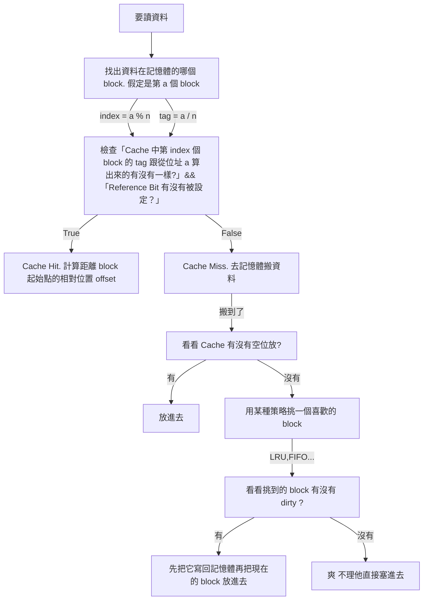
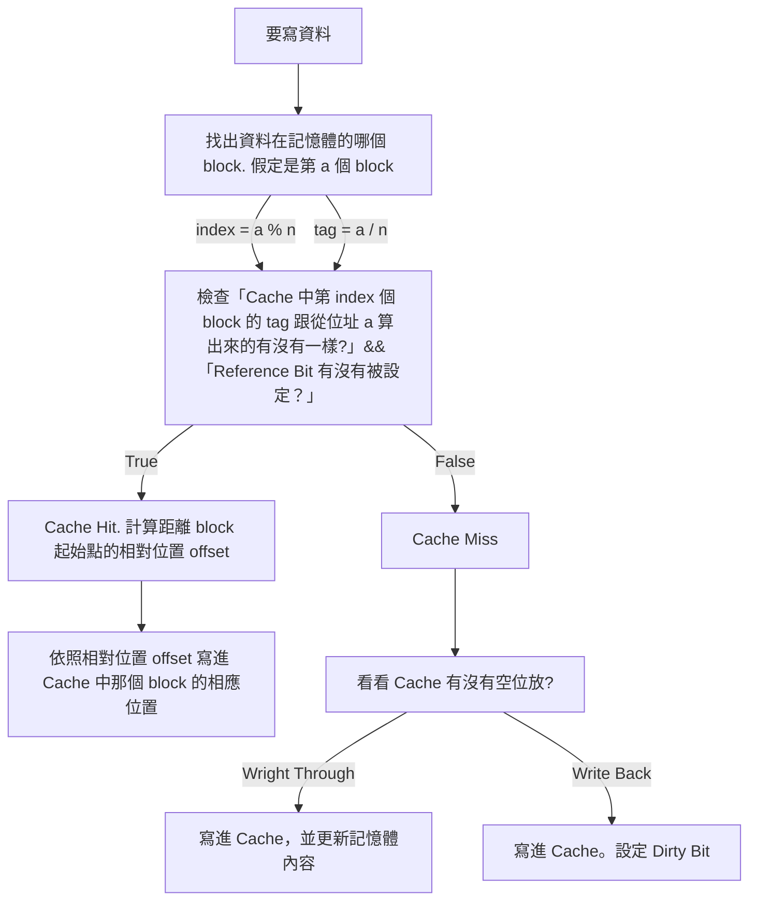
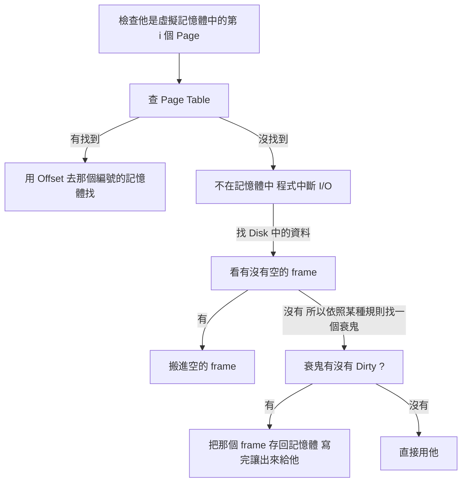

# 動機：Locality

一個程式不會同時使用他的所有功能，一次只有一小部分的東西會使用到。

1. 「剛剛才使用過的東西」：跑迴圈的時候重複的東西就很常用。這種狀況叫做 ==Temporal Locality==
2. 「現在使用的資料附近的資料」舉例來說，開一個陣列存圖，在遍歷的時候會走訪陣列中每一個元素。在存取某一個元素 `G[i][0]` 時，附近的 `G[i][1]` ... `G[i][j]` 等等都會接著用到。這種現叫做 ==Space Locality==。

# 概念

因為記憶體差距越來越大，所以就想到「把常用的東西」放在比較快而小的儲存裝置中（比如說 SRAM），這樣重複使用時就可以快速存取。

1. 一個 Cache 是一個比記憶體小，且存取比記憶體快的 buffer。Cache 會暫存某些資料的副本，CPU 要使用這些資料時，先去看有沒有在 Cache 裡面。如果有的話，就直接從 Cache 裡面拿; 沒有的話再去從記憶體搬。

   > Cache 之於記憶體，像是人的口袋之於背包。比如說很常用的手機可能就會放在口袋裡，這樣要用時很快就可以掏出來。如果把手機放在背包裡面的話，每次用都要翻開背包找半天，效率就沒那麼好。

2. 從記憶體搬動資料到 Cache 裡面時，不會一次搬一個 `byte`，而是==以某個數量的 `byte` 為單位，一次搬進搬出連續的記憶體內容==。這是因為考量==Space Locality==：通常相鄰的資料接下來都很有可能會用到。一次搬進搬出的單位叫做 `Block`。

3. 因為搬進搬出是以 `block` 為單位，因此 `Cache` 中也可以以 `block` 的大小為單位，區分成很多個 `block`。每個 `block` 都可能暫存記憶體的某些資料（當然也可能根本沒有用到）。

議題：

1. 記憶體中的資料以什麼為依據放進 `Cache` 裡？
2. 當 CPU 在讀/寫的時候，要怎麼存取到想要存取的資料？
3. 如果 `Cache` 滿了，但是有新的東西想要放進來，那要用什麼機制挪出空間？
4. `Cache` 裡面的東西只是副本。因此若進行修改，需要有同步機制。

# Direct Mapping Cache

## Placement Policy

假定 `Cache` 中總共有 `b` 個 `block`，==則 Cache 的第 i 個 block，專門擺實體記憶體中那些編號是「除 n 餘 i」的 block==：


以上圖為例，Cache 總共有 8 個 block。所謂「==Cache 的第 i 個 block，專門擺實體記憶體中那些編號是「除 b 餘 i」的 block==」的意思是：

* Cache 中的第 2 個 block (灰色)，是專門給那些記憶體中「除 8 餘 2」的 block 的位置; 
* Cache 中的第 5 個 block (藍色)，是專門給那些記憶體中「除 8 餘 5」的那些 block 的位置。

==這個「除以 b 的餘數」，在書中稱作 `index`。==

另外，因為「取餘數」如果除數是二的冪次，那麼可以用位元運算處理（原理就像如果要算 87,654,321 除 1,000 的餘數，只要取最後面的 321 就可以了）。因此只要可以實作「取最低的那幾個位元」，就可以很方便的實作出來。

但這很明顯有個東西要考慮：==除以 `n` 餘 `index` 的 `block` 可能很多，要怎麼知道現在在 `Cache` 裡面的是哪一個？==為了做到可以分辨這件事，要對這個設計進行一些改良。方法是這樣：在剛剛==除法的計算中，多把那個餘數對應的「商」紀錄下來(高位元)，作為辨識==。這個「商」在書中使用的術語是 `tag`。

> 這件事也可以用除法原理去思考。假定某一個 block 是實體記憶體裡面的第 a 個 block，而 n 是 Cache 有的 block 數目，除法原理知道 a 可以表示成：
  $$
  a = bq + r \text{$\quad \quad q, r \in \mathbb{N}$, r < b}
  $$
>且 p, r 是唯一的。這邊 p 就是 `tag`，r 就是 `index`。

上面的概念畫成 data path 之後，大致如下：


拿到一個 block 的編號(在上圖中是 Address)之後，進行兩個動作：

1. 找出「餘數」：也就是比較低的那些位元，稱作 index。餘多少就去問 Cache 的第幾個 entry 裡面有沒有資料。
2. 找出「商」：比較 entry 中儲存的 tag ，跟這個位址的 tag (也就是算出來的商)是不是相同？如果相同就表示在 Cache 裡面; 沒有的話就是 Cache Miss，要去記憶體裡面搬。

一句話講完的版本（雖然很長）就是：

> 假定` a` 在記憶體中第 `tag` 個「除以 『`Cache 的 block 總數` 』餘 `index` 」的 `block` ，那就會把 `a` 所在的 `block` 放在第 `index` 個 `Cache` `block` 中。並且記錄 `tag`。

## 細節：Reference Bit & Dirty Bit

上面那個設計還有一些問題要考慮，比如說：

1. 該怎麼區分「Cache 裡面存的 block 真的是記憶體中對應的那個 block」或是「 Cache 裡面並不是存有意義的資料，而是存沒有初始化的垃圾，只是湊巧比對結果一樣」？
2. Cache 當中的資料只是副本。怎麼知道什麼時候要把 Cache 裡面的東西寫回記憶體？

這個問題的解法是各設一個 bit 當作 flag：

1. ==Reference Bit==：一開始設成 0 。假定有人把東西存進去，就設成 1; 直到這個 block 沒有人用時，再設成 0。這樣就可以區分上述兩個狀況的不同。
2. ==Dirty Bit==：假定沒有人寫過這個 block，就設成 0。如果有人改變過裡面的內容，那麼就設成 1。

> 假定` a` 在記憶體中第 `tag` 個「除以 『`Cache 的 block 總數` 』餘 `index` 」的 `block` ，那就會把 `a` 所在的 `block` 放在第 `index` 個 `Cache` `block` 中。並且記錄 `tag` 跟 Dirty Bit 以及 Reference Bit

## 例子：

假定規格是：

1. 每個 block 的 block size 是 4 個 byte。
2. Cache 大小是 4 kB。
3. 實體記憶體總共有 2GB。

假定有要存取的資料的位址，那麼整個 data path 如下：


這邊有一些關於「哪些 entry 至少需要錢用多少位元」的資訊。以這個狀況為例：

1. Cache 有 4096 / 4 = 1024 個 block
2. Memory 有 2GB / 4 = 512M 個 block，也就是 $2^{29}$ 個。所以需要使用一個 29 位元的數字去編號一個 block。
3. 這 29 個位元中，因為 Cache 總共有 1024，也就是 $2^{10}$ 個 blocks。把這個數字當除數，除以一個 29 位元的數字的話，餘數（也就是 index）需要 10 個位元表示，而商(也就是 tag) 需要 19 位元。

因此，一個 Cache 的 Entry 中，會須要：

1. 1 個 block 的資料：也就是 4 byte，32 位元
2. 1 個 tag 的資料：19 位元
3. 1 個 reference bit：1 位元
4. 1 個 dirty bit：1 位元

總共是 53 個 bit。

> 待補：byte offset

## 讀取



## 寫入




## 設計議題：Write-Through vs. Write-Back

當 Cache 當中資料被更改時，需要立刻寫入記憶體嗎？還是直到有人需要 Replace，再進行回寫就好？這時有兩種策略：

1. ==Write Through==：==Cache 有什麼更動，就立刻更新到記憶體裡面相應的內容==。這樣做好處是資料可以時時保持同步，但壞處就是會花超多時間。所以起中一個解法是把這個寫入進行 buffer，寫把改變寫進 buffer 裡面，buffer 再慢慢把改變更新到記憶體中。
2. ==Write Back==： Lazy Evaluation 。==Cache 中的副本有變動時，不立刻寫入，但是把 Dirty Bit 標上==。等到 Cache 中產生碰撞，要把那個 block 換下去時，再把改變更新到記憶體中。

## 設計議題：Block Size

Block Size 一般來說不能太小，因為夠大的 Cache 是解掉 Space Locality 的一個重要因素，就是因為有「順便把附近資料一起搬進來」這件事，才免於頻繁的進出記憶體。

另外一方面來說，Block Size 也不能太大，因為太大的話，會讓整體的 block 數目變少，使得碰撞更容易發生，需要頻繁地把 Cache 的東西寫回記憶體中，速度就變慢了。另外，很大的 block 也很容易 Dirty，所以使得回寫記憶體的可能性就更高了。

## 缺點

這樣的缺點是：如果每次要存取的資料，剛好都是一樣的 index，但是 tag 不同的資料，那麼每次存取的時候都會發生 Cache Miss; 但這樣的存取照理說滿常見的，比如說：

```c
int array[1 << 12];
/* some other things */
int sum = 0;
for (int i = 0; i < (1 << 12); i += CACHE_BLOCK_SIZE * CACHE_BLOCK_NUM) {
    sum += array[i];
}
```

這樣一來，就必定每次都會踩到「同樣 index，不同 tag」的區段，就會讓這個 CACHE 爆掉。這個問題的關鍵是：==在這個 Cache 當中，相同 index 的 block 只能有一個==。這個問題跟雜湊表碰撞的問題有點像，解法也有點像，就是==允許同樣 index 的東西==

# n - Ｗay Associated Cache

之前的 Cache 中，「同一個 index 的 block 一次只能存 1 個」。現在把它改成「==同一個 index 的 block 可以存 n 個==」，像這樣：


1. 「詢問某個 tag 的 block 有沒有在 cache 裡面？」是可以 O(1) 做到的：只要用一堆比較器同時比較就可以了。

2. 這時，每 `n` 個 block 稱作一個 set。因此問題就變成：

   > 假定` a` 在記憶體中第 `tag` 個「除以 『Cache 的 Set 總數 』餘 `index` 」的 `block` ，那就會把 `a` 所在的 `block` 放在第 `index` 個 set 中。並且記錄 `tag` 跟 Dirty Bit 以及 Reference Bit

3. 這樣一來會多出一個問題：當一個 set 中有人要被寫回記憶體時，要有多少個


## 特例：Way = n

因為 Way 的數目跟 Cache Block 數目一樣多，所以一個 way 只能放一個 block，但這根本就是 direct map 嘛！

## 特例：1-Way (Fully-Associated)

因為整個 Cache 都是一個 Way，所以實際上這是「Cache 有空就放進去」。這種設計叫做「fuly associate」。缺點是需要海量的比較器。


# Virtual Memory

假定一個程式 8G，但是電腦記憶體只有 2G，可是你知道任意時刻最多只會用到那 8G 程式中 64MB 的程式。這時候就會想讓他定址到 8G，只要「要什麼資料有什麼資料」，那不管怎麼做，看起來就像記憶體夠用 —— 即使電腦實體上的記憶體根本沒辦法一次把整支程式塞進去。就是「虛擬記憶體」的概念。

基本上就是把記憶體當成 Cache，把 Mass Storage (以下為了打字方便，就簡稱叫 Disk)。但設計上跟 Cache 有幾個不同之處：

1. Cache 有很多種擺放策略，比如說 Direct Map 、 n-way 等等。但對於 Memory 跟 Disk 之間的 I/O 來說，因為時間大約相差了 5, 6 個數量級，回寫的代價非常高昂，要盡可能的減少把東西從記憶體踢回 Disk 的機會。因此採取==記憶體有空間就放進去==，也就是==fully associated== 的策略。


基本的組成如下：


1. Disk 的基本單位稱作 `PAGE`，一次會以一個 Page 為單位進行搬進搬出。
2. 在記憶體中，跟一個 Page 大小的記憶體，稱作一個 frame 。
3. 需要使用 Disk 中的資料時，會把東西從 Disk 搬進記憶體中。一次以一個 page 為單位搬進去。
4. 因為現在的策略是「有空間就塞」，所以需要有一個索引去記錄「 Disk 中的第幾個 Page ，擺在記憶體中的第幾個 frame ?」。這個索引是一個表，叫做 Page Table。是由 OS 去維護的。
5. 如果需要使用資料時，發現 Page Table 查不到這塊資料有被記錄在記憶體中，CPU 的工作就要停下來，等到東西從 Disk 被搬到記憶體中。這件事情稱作 Page Fault，而且會花上超超超超超多時間。所以這時 CPU 不會等東西 I/O 完，而是先中斷給其他程序用，I/O 完之後再回來繼續。
6. 同樣有 Dirty Bit、Valid Bit 的機制。

所以舉例而言，要使用虛擬記憶體中的某個資料 a 時：



1. 由 a 的位置計算 a 在 Disk 中的第幾個 Page。算「第幾個」這件事情其實就是做除法，而做除法在二進位中就是取高位元。因此要做這件事，只要做位元運算就好。
2. 拿這個「第幾個」的編號去查 Page Table 查「那一個 Page 的資料，是放在記憶體中的第幾個 Frame」。
3. 如果有查到，就直接從記憶體讀取。因為是整個 Page 的東西原封不動搬出來（就像考古學家一樣），要知道「這個資料離 page 的起始點多遠」，其實就是在算「a 的位置 % Page 大小」的餘數。而取餘數在二進位中，取低位元就得到。因此曲低為元就可以知道 Offset 是多少。
4. 如果查無此 Page，表示對應的 frame 不再記憶體中，要從 Disk 中進行 I/O。也就是 Page Fault 發生。

這裡來有一些細節：

1. Replacement Policy：有可能記憶體會滿出來，這時要想一些策略把記憶體中的東西寫回去，換新的東西上去，比如說 LRU。但因為 LRU 很複雜，所以要有一些替代方案。其中一種是每個 Page Table 的 Enrty 多加一個位元，用來記錄「有沒有用過」。這個位元每段固定時間會被清空成 0，用過就會被設成 1。如果在某個時候記憶體不夠用，要把東西寫回 Disk 時，就看有沒有人的位元是 0？有的話就把他寫回去，換接下來要用的人上來。這個位元叫做 reference bit。
2. Write Back：因為時時刻刻 write-through 意味著要頻繁的進行記憶體跟 Disk 間的 I/O，是一件代價非常高昂的事情，因此不會採用。都是採用 Write Back。

## 問題

1. Page Table 可能會超級大。比如說 4G 記憶體，512G SSD，一個 Page 是 4K，這樣一來 SSD 中就會有 $2^{39}/2^{12} = 2^{27}$ 個 Page，光存這個資訊就要用掉 27 個 bit。加上要知道是記憶體中的哪個 frame，因為記憶體有 $2^{32} / 2^{12} = 2^{20}$ 個 frame，也就是需要 20 bit 記錄。因此全部記錄就需要 27 + 20 = 47 個 bit，還不含 Dirty/Valid/Reference 這種資訊。
2. 因為 Page Table 存在記憶體中，所以這樣需要「看 Page Table」跟「從記憶體搬東西」兩次存取。希望可以減少。

### 改良：TLB

把常用的 Page Table Entry 存在比較快的儲存裝置中，在查 Page Table 之前先去查 TLB，就可以減少存取 Page Table 的次數。


### 改良：