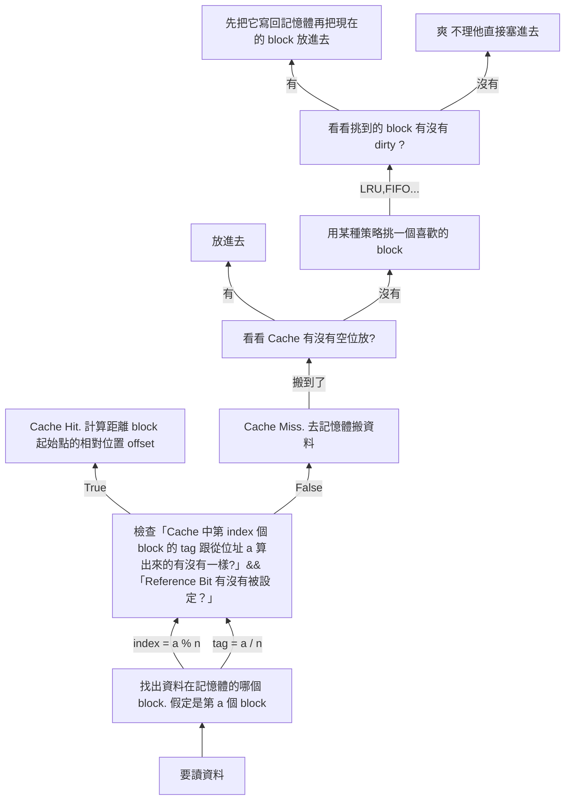
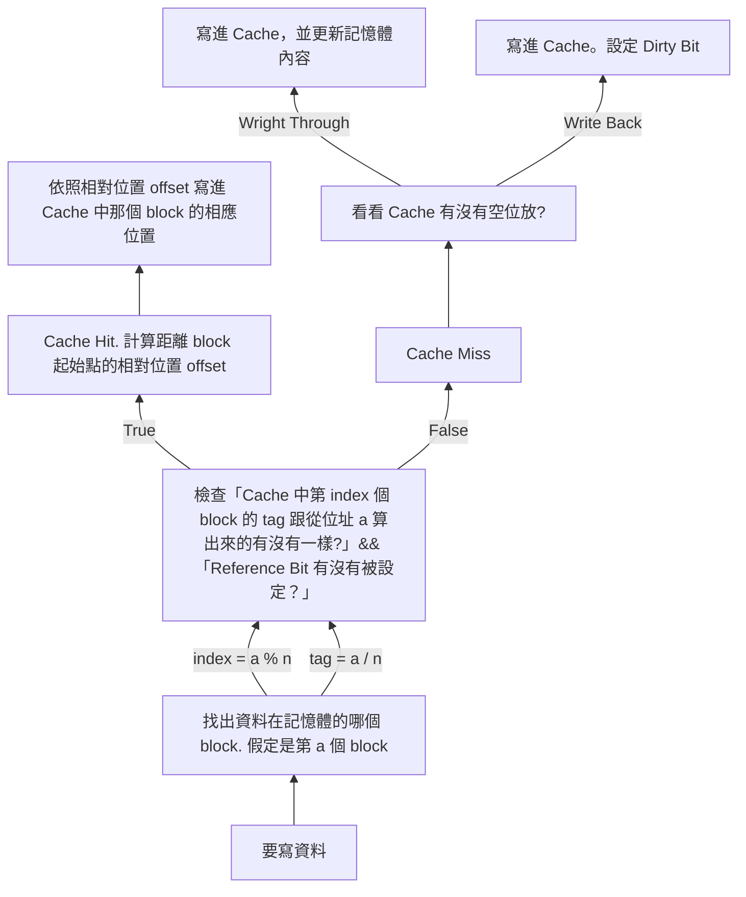
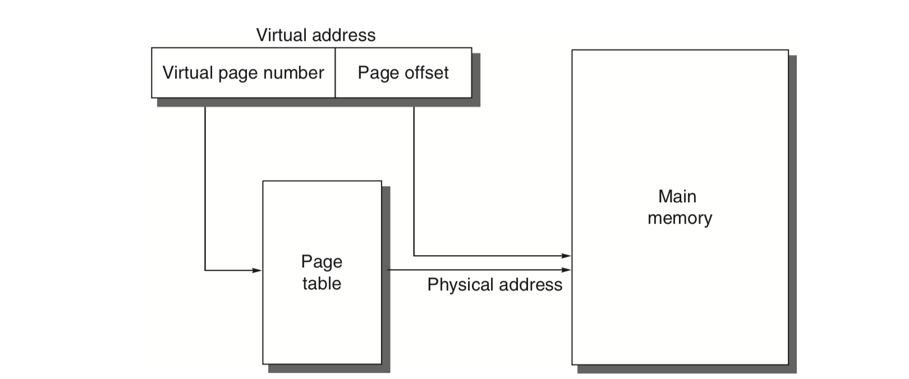
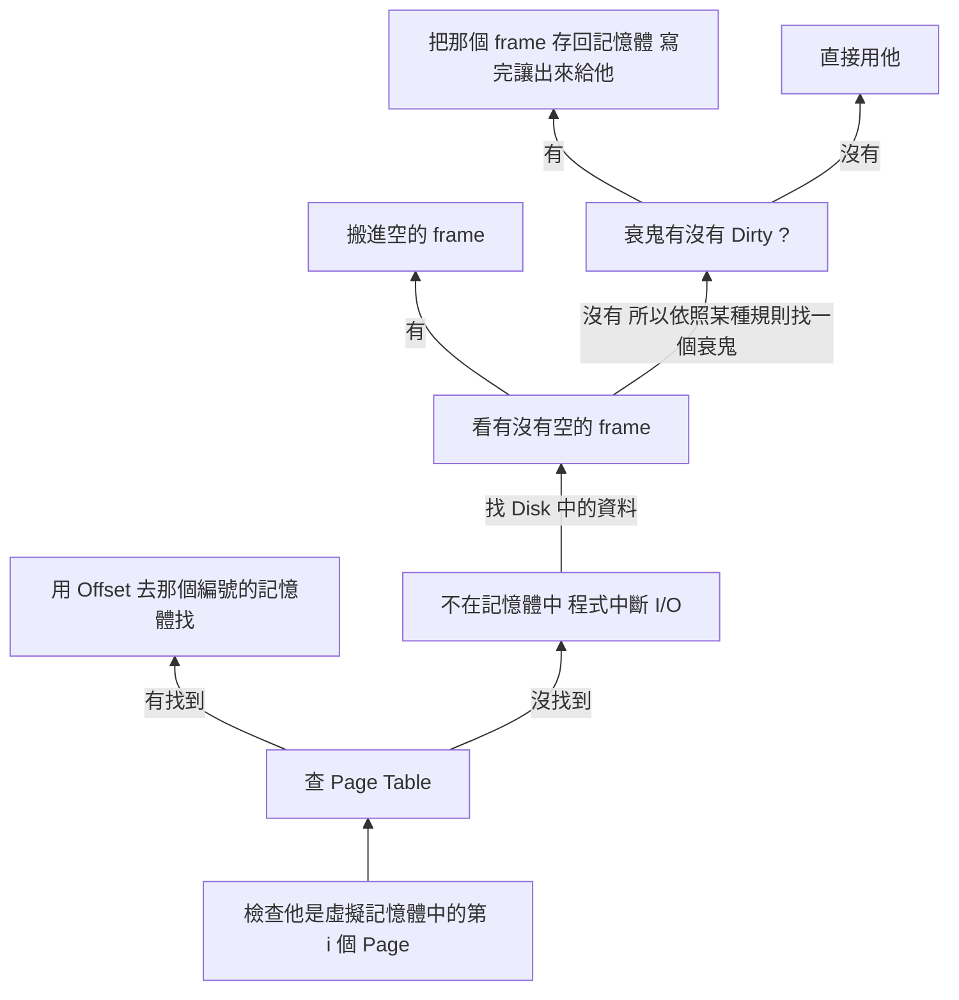
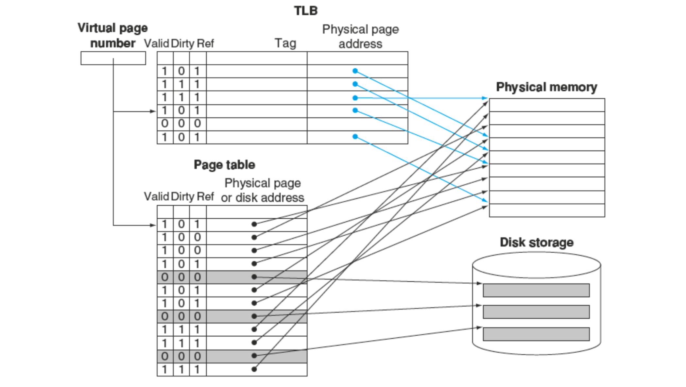
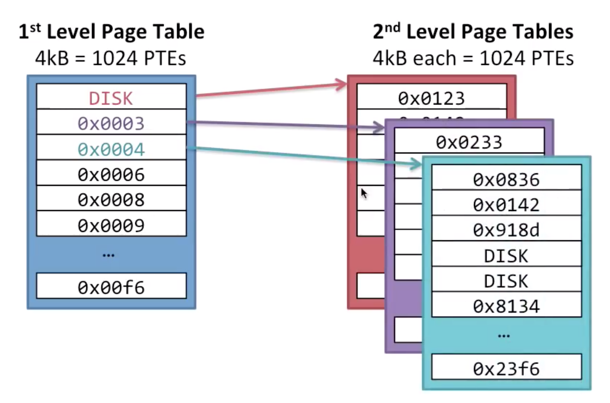
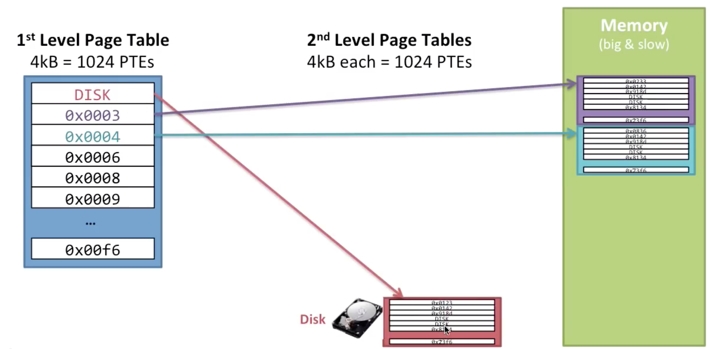
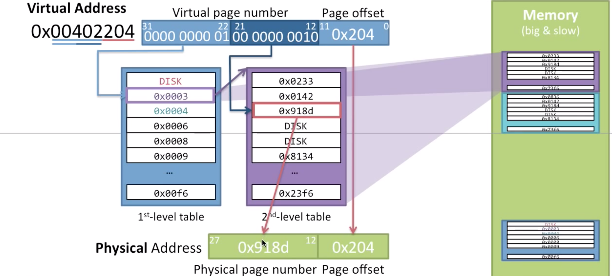
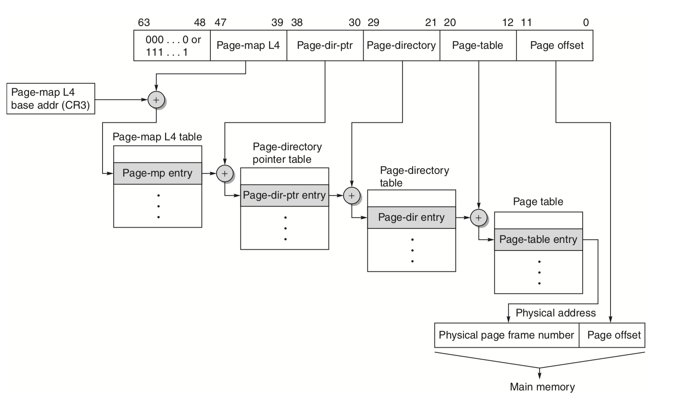

# 動機：善用 Locality

一個程式不會同時使用他的所有功能，一次只有一小部分的東西會使用到。而且有有兩種狀況常常發生：

1. 「剛剛才使用過的東西」：跑迴圈的時候重複的東西就很常用。這種狀況叫做 ==Temporal Locality==
2. 「現在使用的資料附近的資料」舉例來說，開一個陣列存圖，在遍歷的時候會走訪陣列中每一個元素。在存取某一個元素 `G[i][0]` 時，附近的 `G[i][1]` ... `G[i][j]` 等等都會接著用到。這種現叫做 ==Space Locality==。

# 概念

因為記憶體差距越來越大，所以就想到「把常用的東西」放在比較快而小的儲存裝置中（比如說 SRAM），這樣重複使用時就可以快速存取。

1. 一個 Cache 是一個比記憶體小，且存取比記憶體快的存取元件。Cache 會暫存某些資料的副本，CPU 要使用這些資料時，先去看有沒有在 Cache 裡面。如果有的話，就直接從 Cache 裡面拿; 沒有的話再去從記憶體搬。

   > Cache 之於記憶體，像是人的口袋之於背包。比如說很常用的手機可能就會放在口袋裡，這樣要用時很快就可以掏出來。如果把手機放在背包裡面的話，每次用都要翻開背包找半天，效率就沒那麼好。

2. 從記憶體搬動資料到 Cache 裡面時，不會一次搬一個 `byte`，而是==以某個數量的 `byte` 為單位，一次搬進搬出連續的記憶體內容==。這是因為考量==Space Locality==：通常相鄰的資料接下來都很有可能會用到。一次搬進搬出的單位叫做 `Block`。

3. 因為搬進搬出是以 `block` 為單位，因此 `Cache` 中也可以以 `block` 的大小為單位，區分成很多個 `block`。每個 `block` 都可能暫存記憶體的某些資料（當然也可能根本沒有用到）。


# 四大問題

*Computer Architecture A Quantitative Approach* (算盤書作者的另外一本書) 認為，討論這種「記憶體階乘」時，有 4 大核心議題要探討：

1. Where can a block be placed in the upper level ?
2. How is a block found if it is in the upper level ? 
3. Which block should be replaced on a miss ? 
4. What happens on a write ?

# Direct Mapping Cache

## Q1：Where can a block be placed in the upper level ?

這個答案是「取餘數」。

假定 `Cache` 中總共有 `b` 個 `block`，==則 Cache 的第 i 個 block，專門擺實體記憶體中那些編號是「除 n 餘 i」的 block==。也就是：
$$
位址\mod {cache\ 中\ block\ 的數目}
$$
示意圖像下面這樣：


以上圖為例，Cache 總共有 8 個 block。所謂「==Cache 的第 i 個 block，專門擺實體記憶體中那些編號是「除 b 餘 i」的 block==」的意思是：

* Cache 中的第 2 個 block (灰色)，是專門給那些記憶體中「除 8 餘 2」的 block 的位置; 
* Cache 中的第 5 個 block (藍色)，是專門給那些記憶體中「除 8 餘 5」的那些 block 的位置。

==這個「除以 b 的餘數」，通常稱作 `index`。==

這邊可以注意一個小細節：「取餘數」乍聽之下很花時間，但==如果除數是二的冪次，那麼可以用位元運算處理==。因此只要可以實作「取最低的那幾個位元」，就可以很方便的實作出來。大概像這樣：


（這個道理就像：如果要算 87,654,321 除 1,000 的餘數，只要取最後面的 321 就可以了）

但這很明顯有個東西要考慮：==除以 `n` 餘 `index` 的 `block` 可能很多，要怎麼知道現在在 `Cache` 裡面的是哪一個？==為了做到可以分辨這件事，要對這個設計進行一些改良。方法是這樣：在剛剛==除法的計算中，多把那個餘數對應的「商」紀錄下來(高位元)，作為辨識==。這個「商」在書中使用的術語是 `tag`。

> 這件事也可以用除法原理去思考。假定某一個 block 是實體記憶體裡面的第 a 個 block，而 n 是 Cache 有的 block 數目，除法原理知道 a 可以表示成：
$$
a = bq + r \text{$\quad \quad q, r \in \mathbb{N}$, r < b}
$$
>且 p, r 是唯一的。這邊 p 就是 `tag`，r 就是 `index`。

上面的概念畫成 data path 之後，大致如下：


拿到一個 block 的編號(在上圖中是 Address)之後，進行兩個動作：

1. 找出「餘數」：也就是比較低的那些位元，稱作 index。餘多少就去問 Cache 的第幾個 entry 裡面有沒有資料。
2. 找出「商」：比較 entry 中儲存的 tag ，跟這個位址的 tag (也就是算出來的商)是不是相同？如果相同就表示在 Cache 裡面; 沒有的話就是 Cache Miss，要去記憶體裡面搬。

一句話講完的版本（雖然很長）就是：

> 假定` a` 在記憶體中第 `tag` 個「除以 『`Cache 的 block 總數` 』餘 `index` 」的 `block` ，那就會把 `a` 所在的 `block` 放在第 `index` 個 `Cache` `block` 中。並在記錄 `tag`。

### 細節：Reference Bit & Dirty Bit

上面那個設計還有一些問題要考慮：

1. 該怎麼區分「Cache 裡面存的 block 真的是記憶體中對應的那個 block」或是「 Cache 裡面並不是存有意義的資料，而是存沒有初始化的垃圾，只是湊巧比對結果一樣」？
2. Cache 當中的資料只是副本。怎麼知道什麼時候要把 Cache 裡面的東西寫回記憶體？

這個問題的解法是各設一個 bit 當作 flag：

1. ==Reference Bit==：一開始設成 0 。假定有人把東西存進去，就設成 1; 直到這個 block 沒有人用時，再設成 0。這樣就可以區分上述兩個狀況的不同。
2. ==Dirty Bit==：假定沒有人寫過這個 block，就設成 0。如果有人改變過裡面的內容，那麼就設成 1。

> 假定` a` 在記憶體中第 `tag` 個「除以 『`Cache 的 block 總數` 』餘 `index` 」的 `block` ，那就會把 `a` 所在的 `block` 放在第 `index` 個 `Cache` `block` 中。並且記錄 `tag` 跟 Dirty Bit 以及 Reference Bit

### 例子：

假定規格是：

1. 每個 block 的 block size 是 4 個 byte：所以最後面的 offset 有 2 個位元。
2. Cache 大小是 4 kB：所以總共有 1024 個 block。
3. 實體記憶體總共有 2GB。

假定有要存取的資料的位址，那麼整個 data path 如下：


這邊有一些關於「哪些 entry 至少需要用多少位元」的資訊。以這個狀況為例：

1. Cache 有 4096 / 4 = 1024 個 block
2. Memory 有 2GB / 4 = 512M 個 block，也就是 $2^{29}$ 個。所以需要使用一個 29 位元的數字去編號一個 block。
3. 這 29 個位元中，因為 Cache 總共有 1024，也就是 $2^{10}$ 個 blocks。把這個數字當除數，除以一個 29 位元的數字的話，餘數（也就是 index）需要 10 個位元表示，而商(也就是 tag) 需要 19 位元。

因此，一個 Cache 的 Entry 中，會須要：

1. 1 個 block 的資料：也就是 4 byte，32 位元
2. 1 個 tag 的資料：19 位元
3. 1 個 reference bit：1 位元
4. 1 個 dirty bit：1 位元

總共是 53 個 bit。

> 待補：byte offset

## Q2 : How is a block found if it is in the upper level ?

因為當初存進去的時候是用「餘數」，所以只要反推就可以知道了。



## Q3 : Which block should be replaced on a miss ? 

如果 Cache 裡面第 `i` 個 block 已經佔用了，然後有新的資料要搬進來，這時候沒有什麼意外要直接把他換出去。聽起來合理。

## Q4 : What happens on a write ?

寫入的問題是這樣：要==寫東西要改動 Cache 裡面的東西，還是要改記憶體裡面的東西？== 如果改 Cache 裡面的東西，修改 Cache 會比修改記憶體的內容快，但只有 Cache 裡面的副本有更動到，記憶體裡面的東西並沒有變。更進一步衍伸的問題是：什麼時候要把 Cache 裡面修改的東西更新到記憶體中？




### 設計議題：Write-Through vs. Write-Back

當 Cache 當中資料被更改時，需要立刻寫入記憶體嗎？還是直到有人需要 Replace，再進行回寫就好？這時有兩種策略：

1. ==Write Through==：==Cache 有什麼更動，就立刻更新到記憶體裡面相應的內容==。這樣做好處是資料可以時時保持同步，但壞處就是會花超多時間。所以起中一個解法是把這個寫入進行 buffer，寫把改變寫進 buffer 裡面，buffer 再慢慢把改變更新到記憶體中。
2. ==Write Back==： Lazy Evaluation 。==Cache 中的副本有變動時，不立刻寫入，但是把 Dirty Bit 標上==。等到 Cache 中產生碰撞，要把那個 block 換下去時，再把改變更新到記憶體中。

### 設計議題：Block Size

Block Size 一般來說不能太小，因為夠大的 Cache 是解掉 Space Locality 的一個重要因素，就是因為有「順便把附近資料一起搬進來」這件事，才免於頻繁的進出記憶體。

另外一方面來說，Block Size 也不能太大，因為太大的話，會讓整體的 block 數目變少，使得碰撞更容易發生，需要頻繁地把 Cache 的東西寫回記憶體中，速度就變慢了。另外，很大的 block 也很容易 Dirty，所以使得回寫記憶體的可能性就更高了。

## 缺點

這樣的缺點是：如果每次要存取的資料，剛好都是一樣的 index，但是 tag 不同的資料，那麼每次存取的時候都會發生 Cache Miss; 但這樣的存取照理說滿常見的，比如說：

```c
int array[1 << 12];
/* some other things */
int sum = 0;
for (int i = 0; i < (1 << 12); i += CACHE_BLOCK_SIZE * CACHE_BLOCK_NUM) {
    sum += array[i];
}
```

這樣一來，就必定每次都會踩到「同樣 index，不同 tag」的區段，就會讓這個 CACHE 爆掉。這個問題的關鍵是：==在這個 Cache 當中，相同 index 的 block 只能有一個==。這個問題跟雜湊表碰撞的問題有點像，解法也有點像，就是==允許同樣 index 的東西==

# Set Associated Cache

上面的例子中，同樣一個 `index` 的資料，一次只有一個。但這樣可以造出很慢的例子。比如說 Cache 有 16 個 Block，結果程式資料存取就是以 16 個 Block 為單位，結果就發現 Cache 中永遠只有某個 block 被使用，其他都是空的。所以改良方法就是「讓一個 `index` 可以有不止一個 block」。這就是 Associated Cache 的概念。

## Q1：Where can a block be placed in the upper level ?

之前的 Cache 中，「同一個 index 的 block 一次只能存 1 個」。現在把它改成「==同一個 index 的 block 可以存 n 個==」，像這樣：


1. 「詢問某個 tag 的 block 有沒有在 cache 裡面？」是可以 O(1) 做到的：只要用一堆比較器同時比較就可以了。

2. 這時，每 `n` 個 block 稱作一個 set。因此問題就變成：

   > 假定` a` 在記憶體中第 `tag` 個「除以 『Cache 的 Set 總數 』餘 `index` 」的 `block` ，那就會把 `a` 所在的 `block` 放在第 `index` 個 set 中。並且記錄 `tag` 跟 Dirty Bit 以及 Reference Bit 


### 特例：Way = n

因為 Way 的數目跟 Cache Block 數目一樣多，所以一個 way 只能放一個 block，但這根本就是 direct map 嘛！

### 特例：1-Way (Fully-Associated)

因為整個 Cache 都是一個 Way，所以實際上這是「Cache 有空就放進去」。這種設計叫做「fuly associate」。缺點是需要海量的比較器。

## Q2 : How is a block found if it is in the upper level ?

這個跟 Direct Map 類似，只是現在餘數


## Q3：Which block should be replaced on a miss ?

因為現在一個 `index` 可以有不止一個 block 在 Cache 裡面，所以。就有很多種策略：FIFO, LRU, LFU 等等。

## Q4 : What happens on a write ?

這個跟 Direct Map 的狀況一樣。


# Virtual Memory


要在 VR 中製造「可以任意走動」的[假象](https://youtu.be/rYsvB2y2Ero)，需要多大的面積？答案是 4 塊墊子的面積就夠了。另外一個問題：要怎麼用 2GB 記憶體執行 8GB 大小的程式？原理一樣！

假定一個程式 8G，但是電腦記憶體只有 2G，可是你知道任意時刻最多只會用到那 8G 程式中 64MB 的程式。這時候就會想讓他定址到 8G，只要「要什麼資料有什麼資料」，那不管怎麼做，看起來就像記憶體夠用 —— 即使電腦實體上的記憶體根本沒辦法一次把整支程式塞進去。就是「虛擬記憶體」的概念。

基本上就是把記憶體當成 Cache，把 Mass Storage (以下為了打字方便，就簡稱叫 Disk) 當成記憶體。但設計上跟 Cache 有幾個不同之處。

順帶一提，Virtual Memory 我非常推薦[這一系列](https://www.youtube.com/playlist?list=PLiwt1iVUib9s2Uo5BeYmwkDFUh70fJPxX)的影片，講解的超級棒！下面部分的圖是來自這一系列影片的。

##Q1：Where can a block be placed in the upper level ? 

Cache 有很多種擺放策略，比如說 Direct Map 、 n-way 等等。但對於 Memory 跟 Disk 之間的 I/O 來說，因為時間大約相差了 5, 6 個數量級，回寫的代價非常高昂，要盡可能的減少把東西從記憶體踢回 Disk 的機會。因此採取==記憶體有空間就放進去==，也就是==fully associated== 的策略。

基本的組成如下：


1. Disk 的基本單位稱作 `PAGE`，一次會以一個 Page 為單位進行搬進搬出。
2. 在記憶體中，跟一個 Page 大小的記憶體，稱作一個 frame 。
3. 需要使用 Disk 中的資料時，會把東西從 Disk 搬進記憶體中。一次以一個 page 為單位搬進去。
4. 因為現在的策略是「有空間就塞」，所以需要有一個索引去記錄「 Disk 中的第幾個 Page ，擺在記憶體中的第幾個 frame ?」。這個索引是一個表，叫做 Page Table。是由 OS 去維護的。
5. 如果需要使用資料時，發現 Page Table 查不到這塊資料有被記錄在記憶體中，這件事情稱作 Page Fault。因為從 Disk 搬東西到記憶體太花時間了，所以 CPU 會==觸發中斷==，並且開始進行 I.O 。I/O 完之後再回來繼續。
6. 同樣有 Dirty Bit、Valid Bit 的機制。

##Q2 : How is a block found if it is in the upper level ? 

這個作法跟 Cache 很像，只是之前是用餘數算出來位置，現在是直接用一個表去查：



所以，要使用虛擬記憶體中的某個資料 a 時：



1. 由 a 的位置計算 a 在 Disk 中的第幾個 Page。算「第幾個」這件事情其實就是做除法，而做除法在二進位中就是取高位元。因此要做這件事，只要做位元運算就好。
2. 拿這個「第幾個」的編號去查 Page Table 查「那一個 Page 的資料，是放在記憶體中的第幾個 Frame」。
3. 如果有查到，就直接從記憶體讀取。因為是整個 Page 的東西原封不動搬出來（就像考古學家一樣），要知道「這個資料離 page 的起始點多遠」，其實就是在算「a 的位置 % Page 大小」的餘數。而取餘數在二進位中，取低位元就得到。因此曲低為元就可以知道 Offset 是多少。
4. 如果查無此 Page，表示對應的 frame 不再記憶體中，要從 Disk 中進行 I/O。也就是 Page Fault 發生。

如果仔細思考一下：這樣子的存取需要先去存取 Page Table，不管哪個資料都是。但 Page Table 也在記憶體中，這樣每次存取一虛擬記憶體，都要讀一次記憶體。有沒有更快的方法呢？答案就是把常用的 Page Table 條目 Cache 起來，或是乾脆做一個專門放常用的 Page Table Entry 的 Cache 給他。這個東西叫做 Translation Lookaside Buffer (TLB)。這時候架構就會變成像下面這樣：



所以，當需要資料時，同時去 TLB 跟 Page Table 看。如果先在 TLB 找到了，就可以立刻知道這個 Page 在實體記憶體裡面的哪個位置，去查 Page Table 的時間。

另外一個問題是==Page Table 可能會太大==。舉例來說，假設現在是 32 位元的虛擬記憶體，並且 4KB 一個 Page，那麼整個定址空間最多會需要 $2^{32} / 2^{12} = 2^{20}$ 個 Page，所以「第幾個 Page」這個資訊就要用 20 位元存; 加上一些 valid, dirty, permission 等等的位元，隨便假設一個 entry 會用到 32 位元（也就是 4 byte）好了。這樣一個程式就會需要 $2^{20} \times 4$ 個 byte，也就是 4MB。但這還只是一個程式。我現在 `ps aux` 一出來就顯示我有 320 個 process 在跑，如果照這個方式進行分頁，那麼光 Page Table 就會有 1.28 GB 的記憶體在使用。

更嚴重的事情還在後頭：這些存 Page Table 的記憶體還不能塞到 Disk 裡面暫存，因為塞進去之後，如果沒有紀錄 Page Table 塞在哪邊，那之後要去哪裡找這個 Page Table 呢？但到這裡就突然發現：==如果有辦法建一個「Page Table」存哪邊的 Page Table，這樣就可以解掉這個問題了==。所以解法就是==把 Page Table 分層==，像[這樣](https://youtu.be/Z4kSOv49GNc)：



這樣的好處就如同剛剛說的：==可以把暫時不會用的的 Page Table 塞到 Disk 裡面==，像這樣：



而找東西的過程是這樣（看下面那張圖）：假定這個位址是 `0x00402204`，並且每一層的每個 Table 大小都是 4KB，那麼：

1. 先去找 Virtual Page Nuber 的前 10 位元：也就是 31:22 那個，可以發現是 `0000 0000 01` ，也就是 1

   ，並且用它去找第一層 Page Table 的第 `001h` 個 Entry。這個 Entry 會指向第二層 Page Table。

2. 找到第二層 Page Table 之後，Virtual Page Number 的後 10 位元，也就是 21:12 那個 `00 0000 0010`，也就是 2。去找第二層 Page 的第 2 個 Entry，裡面會存對應的實體記憶體位置，也就是 `0x918d`。

3. 找到之後，就去實體記憶體找資料。



這樣一來，最少需要多少個 Page Table 放在記憶體中呢？如果是 2 層的話，只需要放 2 個 Page Table 就可以了（一個放 Page Table 的 Page Table，從 Page Table 的 Page Table 找到的那個 Page Table）。也可以分更多層，就像樹一樣，不難發現：假設每一層的每個 Table 都一樣大，那麼這個==樹有多高，記憶體就同時需要放多少個 Page Table==。這個超帥的改善直接把記憶體用量取 $\lg$ ！

另外，這個作法也可以不只 2 層，也可以有很多層。像 x86-64 的定址就像這樣：




這是 x86-64 的定址，虛擬記憶體是 48 位元（沒錯，x86-64 雖然標榜 64 位元，但實際上只有 48 位元的定址空間），使用 4 層 Page Table 。Page-map L4 就是存「Page table 的 Table 的 Table 的 Table」。而在 2016 年，Linux 已經可以做到 [5 層了](https://lwn.net/Articles/717293/)。

## Q3：Which block should be replaced on a miss ?

有可能記憶體會滿出來，這時要想一些策略把記憶體中的東西寫回去，換新的東西上去，比如說 LRU。但因為 LRU 很複雜，所以要有一些替代方案。其中一種是每個 Page Table 的 Enrty 多加一個位元，用來記錄「有沒有用過」。這個位元每段固定時間會被清空成 0，用過就會被設成 1。如果在某個時候記憶體不夠用，要把東西寫回 Disk 時，就看有沒有人的位元是 0？有的話就把他寫回去，換接下來要用的人上來。這個位元叫做 reference bit。

## Q4 : What happens on a write ?

這個答案是 ==只用 Write Back==。因為時時刻刻 write-through 意味著要頻繁的進行記憶體跟 Disk 間的 I/O，是一件代價非常高昂的事情，因此不會採用。都是採用 Write Back。

### 