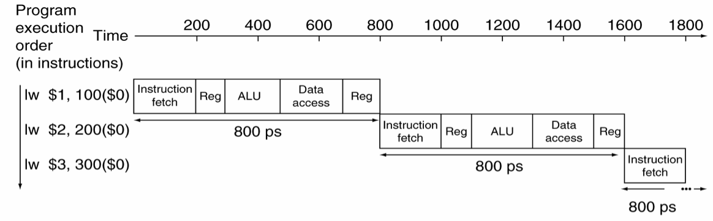
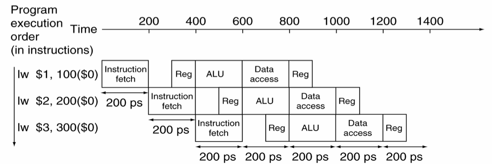
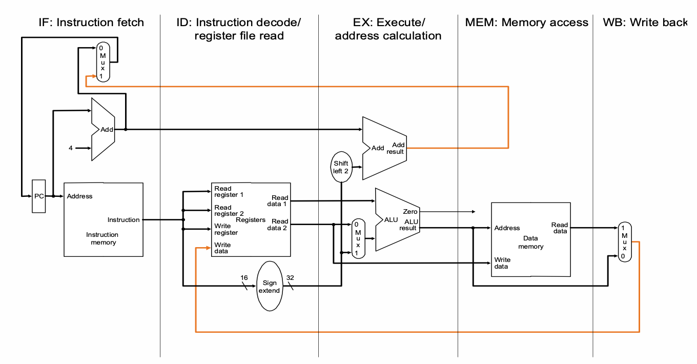
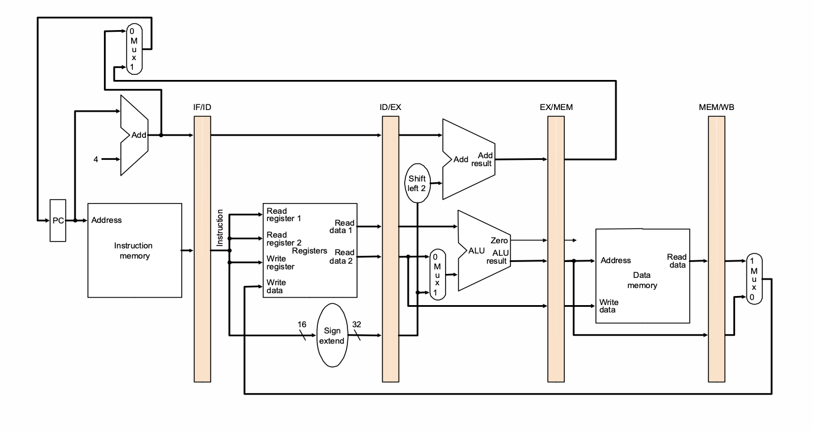
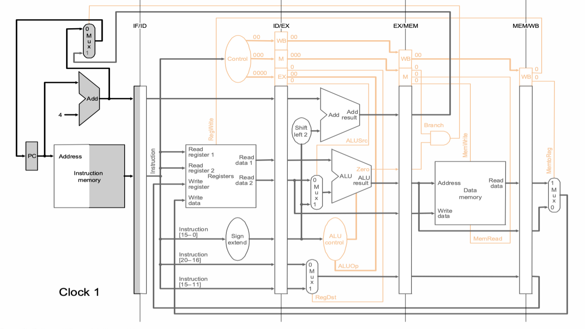
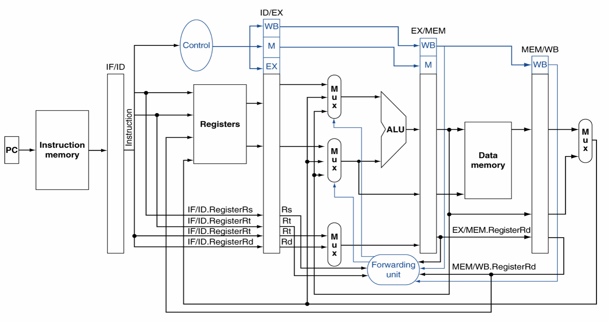
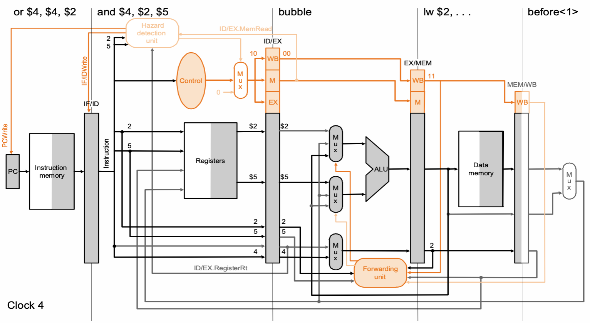
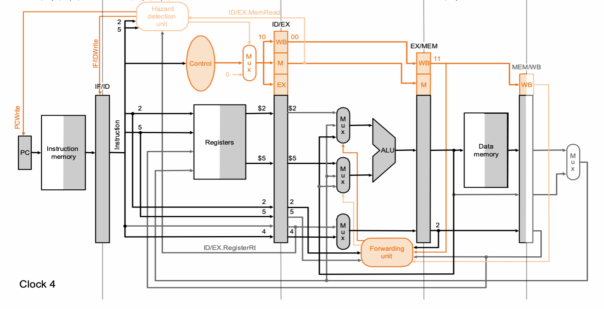
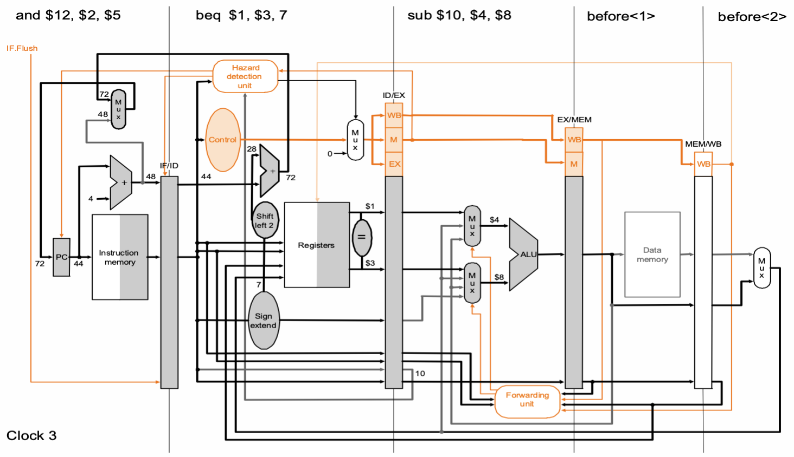
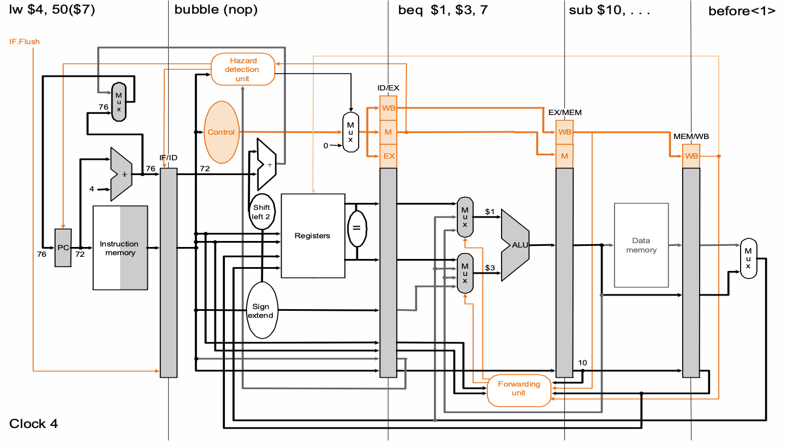

# Pipelineing

Pipeline 有很多層級，硬體、軟體上都有。這邊介紹的是 CPU 使用 Pipeline 改良之後，效能帶來的提升，以及需要考慮的議題

# 觀察：Single Cycle 的改進空間

回顧一下 Single Cycle CPU。所有指令都要走完 Fetch, Decode & Register, ALU, Memory, Write Back 五個階段之後，下一個指令才會繼續進行。可以觀察到：==在 Single Cycle 的時候，執行某一階段時，其他所有階段的硬體都處於閒置==：

這似乎是一件可以改良的地方。Single Cycle 的狀況有點像是：想像有天要在宿舍洗衣服。宿舍的機器有「洗衣機」跟「烘衣機」各一台。如果有一天有人說「在我洗完衣服，並且烘完衣服之前，洗衣機跟烘衣機都不能給其他人用」然後霸佔了整間洗衣服的地方。但明明==洗衣服時不會使用烘衣機，烘衣服的時候不會用到洗衣機==。如果這時候不讓出來給人用的話，這樣不是超級慢嗎？

因此，現在的構想是「一個指令在某個時間只會使用 CPU 的一個 Stage，希望這時其他指令可以使用其他 Stage」。也就是像這樣：



我是覺得滿像灌香腸的。

# 初步構想

先看看一個 Single Cycle 的 CPU，可以大概分成下面這些階段：



現在的目標是「某個指令在 CPU 的某個 Stage 時，其他指令也可以使用 CPU 的 Sgate」。但只要前面 Fetch 的指令變了，後面一大堆東西都會跟著變。因此==要有辦法使前一個階段的資訊，保留到下一個階段==。既然要記憶，就想到在中間插進 Register：



這些插在各階段中間的暫存器叫做 Pipeline Register。更仔細地說，這些暫存器除了存資料（比如說從 Register 讀出的資料、ALU 計算結果等）之外，==還要儲存 Control Signals==。因此，更精確的圖會像是這樣：



這樣就解決了嗎？其實沒有。有一些很微妙的狀況會讓這件事情爆掉。舉例來說：

```assembly
add	$2, $1, $3
add $2, $1, $3
```

會爆掉的點是：`sub` 的東西還在 `MEM` 階段，還沒送到 `WB` 回寫給暫存器時，下一道指令的 `and` 就要用到他算出來的東西。因此這時候，`add` 讀到的 `$2` 值會是錯誤的。

這種狀況叫做「Hazard」，是接下來要處理的地方。

# Hazard

Hazard 泛指處理器沒有辦法正確地依照組合語言語意進行計算的那些錯誤。這些情況分成：

1. ==Data Hazard==：因為「資料相依性」產生的錯誤。像上面的例子。
2. ==Control Hazard==： `j` 類指令在執行後，殘留在 pipeline 中未完成的指令需要進行處理。
3. ==Structural Hazard==：硬體資源的 Race。比如假設現在的架構中，Instruction Memory 跟 Data Memory 沒有分開，這時 instruction fetch 跟 data memory 同時需要使用同一個記憶體。但只要不同階段使用的硬體資源不衝突就可以做到了。

## Data Hazard

這種狀況比如：

```assembly
sub	$2,  $1, $3
and $12, $2, $5
```

這種狀況叫做==Data Hazard==，就是==泛指 CPU 處理資料相依性造成的錯誤==。以上面這個為例，這個狀況是「下一個 Stage 要使用的資料，還在 pipeline 當中，沒被更新到記憶體」，也就是「Write after Read」(簡稱 WAR)。除了這種「連續計算時」有可能會發生之外，還有可能在 `lw` 類的指令發生。比如：

```assembly
lw 	$1, 40($2)
add $2, $3
```

在這個狀況下，是因為 `lw` 指令需要在最後一個階段才會更新暫存器，但在這之前，`add` 就需要用到這個資料了。

理論上來說，因為「資料相依性」造成的錯誤，除了這個狀況之外，也有其他種可能的狀況。比如說：

1. WAR(Write after Read)：正確的結果還沒有寫進去，就讀取了。
2. WAW(Write after Write)：寫入順序前後錯置。比如說先乘除後加減，結果變成先加減後乘除。
3. RAW(Read after Write)：比如說別人還沒讀到正確的東西之前，就有人把他寫成其他東西了。
4. 不會有 RAR 的狀況發生，因為讀取並不會更改資料。所以大家相安無事（就像 rwlock 那樣）。

畫成表格的話大概就像這樣：

|             | Read                               | Write                                                        |
| ----------- | ---------------------------------- | ------------------------------------------------------------ |
| Read after  | (X)                                | 比如說別人還沒讀到正確的東西之前，就有人把他寫成其他東西了。 |
| Write after | 正確的結果還沒有寫進去，就讀取了。 | 寫入順序前後錯置。比如說先乘除後加減，結果變成先加減後乘除。 |

但如果進一步觀察 MIPS 的這個處理器，可以發現：

1. 不會有 WAW：因為從頭到尾只會對暫存器跟記憶體的東西進行一次修改，所以不可能會發生。
2. 不會有 RAW：因為 `WB` 就是最後一個階段，後面的階段就沒有任何跟 Read 有關的階段了，因此不會有這個問題

所以現在的問題是：要怎麼解決 WAR 的問題就好。

### Case 1 : R + R

這種狀況比如說有一個很白目的程式：

```assembly
addi $1, 1
addi $1, 1
addi $1, 1
addi $1, 1
addi $1, 1
```

這種狀況下，第一行的結果還沒進行到 `WB` 階段更新回暫存器，第二行就在 pipeline 中準備使用第一行算出來的結果。

但可以觀察到：==第一行算出來的結果，在第三階段，也就是 `ALU` 的階段，就已經算出來了==。只是因為 pipeling 設計的關係，不得不跟著 pipeline 傳遞。所以這個解法就是：如果發生這種狀況，就==從比較後面的 Stage ，直接把計算結果往前拉給 ALU 用==。這個過程叫做 Forwarding。做出來的 Data Path 會像這樣：



因此，資料來源可能有：

1. 上一個 R-Type 指令算出來的結果：從 EX/MEM 的暫存器中拿。
2. 上上個 R-Type 指令算出來的結果：從 MEM/WB 的暫存器中拿。
3. 上上上個指令準備 WB 給暫存器的結果：這個就是一開始的那個。

而條件是什麼？條件是這樣：

1. 前一個 R-Type 的 `$Rd`，是後一個 R-Type 指令的 `$Rs` 或 `$Rt`，就要把他送回去

2. 前前個 R-Type 的 `$Rd`，是後二個 R-Type 指令的 `$Rs` 或 `$Rt`，也要把他送回去。

所以 FU 的虛擬碼大概會像：

```verilog
assign EX_Hazard_Rs = 
		EX_MEM.RegWrite &&
		EX_MEM.Rd == ID_EX.Rs &&
		EX_MEM.Rd != 0
	
assign MEM_Hazard_Rs = 
		MEM_WB.RegWrite &&
		MEM_WB.Rs == ID_EX.Rs &&
		MEM_WB.Rd != 0

if (EX_Hazard_Rs)
	MUX_Rs = b'10;
else if (MEM_Hazard_Rs)
	MUX_Rs = b'01;
else
	MUX_Rs = b'00;
```

這只是其中一道 ALU 輸入需要進行的更動，另外一道也要改動。只是把東西改成 `Rt` 而已。

### Case 2：Lw + R-Type


先看一眼目前的 Data Path。因為 Load 指令要 Load 的資料，要到最後面的 `WB` 階段才會更新暫存器，不像前面 R-Type 的指令在 `EX` 階段就算出來，所以很明顯 Forward 沒辦法得到好處。

這時候有一個萬能的作法：==停住等 `lw` 拿到資料拿到再跑==。這時候就有兩個問題：

1. 要停多久？
2. 要怎麼停？

第 2. 個問題相對簡單，因為哪邊的 Control Signal 送 0，哪邊就不會動。而這邊的 Control Signal 都是存在 Pipeline 暫存器中，所以只掉==把 Pipeline Register 中存 Control Signal 的暫存器寫成 0==，就可以叫 Pipeline 後面的階段什麼都不要做，也就達成了停住的效果。

第 1. 個問題可以這樣思考：==一直要到 `lw` 指令處在 `WB` 階段時，下一個有資料相依性的 R-Type 指令才可以進入 `EX` 階段。因此需要插入一個 bubble 在 R-Type 跟 `lw` 中間==，讓 `lw ` 可以比下一個有資料相依性的 R-Type 指令多前一個 Stage。

而「一個 `lw` 指令的 `$Rd` 的下一個指令是 R-Type，而且那個 R-Type 的 `$Rs` 跟這個 `lw` 的 `Rd` 一樣」這件事至少要在下一個 R-Type 指令進入 `ID` 階段之後才會知道，所以最早可以在「R-Type 在 `ID`階段、`lw` 在 `EX`階段 」這時候檢測到有沒有這個 Hazard 發生。

因此，我們要設計一個這樣的控制元件：

1. 如果在 `EX` 階段發現「現在 `ID` 階段的是 R-Type 指令，而`EX` 階段指令是 `lw`」而且「那個 `lw` 指令的 `Rd` 跟這個 R-Type 指令的 `Rs` 或 `Rt` 一樣」，那就有 Hazard

2. 插入一個 bubble：意思是在下一個階段：

   1. 本來在`IF` 的指令就停留在 `IF`;  `ID` 的指令就停留在 `ID`。
   2. `lw` 指令繼續進行到 `MEM`階段。
   3. 至於中間的 `EX`要是一個完全空白的東西：也就是這時候看到的 Control Signal 通通都要是 0。

   也就是像這樣：

   | before bubble                                                | after bubble                                                 |
   | ------------------------------------------------------------ | ------------------------------------------------------------ |
   |  |  |

因此，邏輯就是：

```verilog
if(EX_MemtoReg == 1)
begin
	if(ID_Rs == EX_WR_out || ID_Rt == EX_WR_out)
	begin
		PCWrite = 0; //don't write PC
		IF_IDWrite = 0; //Halt data from IF_ID register//
		ID_Flush = 1; //bubble, I.E. set all control signal to 0//
	end
end
```

因此，現在的 Data Path 變成：



## Control Hazard

這個狀況是這樣：假定現在有個 `bne` 指令。因為會先比較兩者結果，再決定要不要跳，因此「要不要跳」這件事至少要到 ALU 運算結果出來之後才會知道，也就是 `EX` 階段。這樣看起來，如果 `bne` 比較結果需要進行跳躍，那麼就必須 flush 掉 `ID` 跟 `IF` 裡面的東西，也就是需要 2 個 bubble。但實際上可以更快，因為==在 `ID` 階段中，`Rs` 跟 `Rt` 暫存器的內容就已經知道了==，因此可以提前比較，不用等 ALU，並且直接拉給 PC 前面的 MUX 就好。這樣一來，因為提前在 `ID` 就只需要 flush 掉 `ID`階段的東西即可：





這時候有一個問題：如果猜中 Branch 指令的結果，那麼就不用多浪費一個週期 flush？這就是 branch prediction 的動機！

# Branch Prediction

## 1 - bit Branch Predict

最簡單的方法是用一個位元記憶上一次是跳或是沒跳，並以這個作為依據，上一次跳就預測跳; 上一次沒跳就預測沒跳。

## 2 - bit Branch Predict

這樣聽起來不錯，但是在雙重回圈時，每次外圈迴圈要跳回去時都會預測失敗。因此有一種改良式「使用 2 個位元」，要「連續兩次不一樣」才會改變對於 jump 的預測。

## Delayed Branch

在 Hazard 發生時，不塞 bubble，改塞一個「不論有沒有 branch 都會進行的指令」。比如說：

```c
a > b ? c[3]:c[3] + 1;
```

不管比較是真或假，都需要存取 `c[3]`，因此就可以 branch 的 bubble 取代成 `lw 12($Rt)` 之類的指令。

# Exception & Interrupt

# Parallelism

上面這邊展現一種平行的方法。

