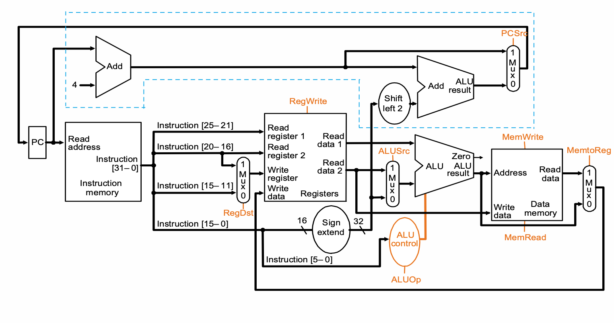
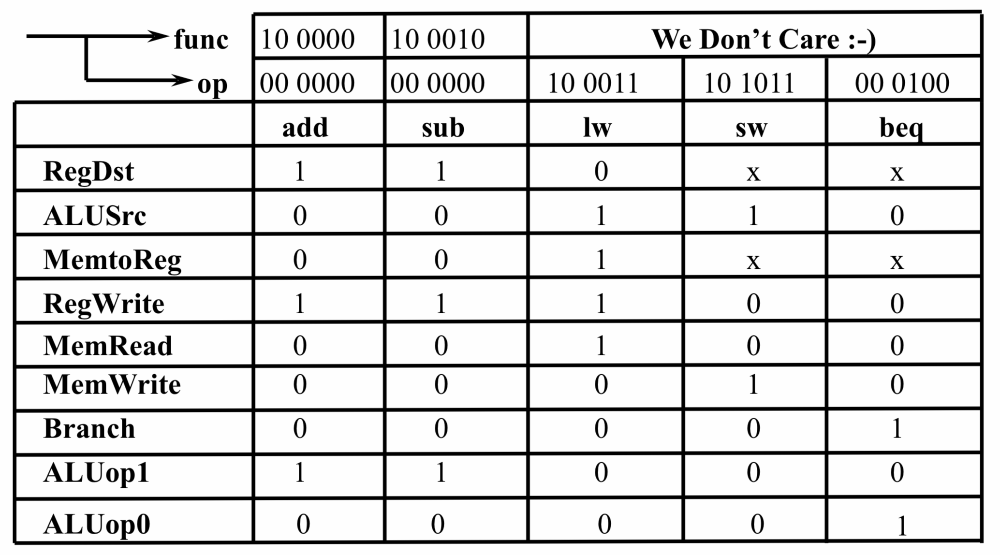

# Single Cycle

現在要進行一個 Single Cycle 的動作。

# Outline

基本上要做的事情會有下面兩件：

1. 爆開 ISA：就是 ISA 提供什麼資訊，就拿去餵暫存器、ALU 等等。舉例來說，R-Type 指令有 `Rs`, `Rt`，就設計一條路取出 `Rs`, `Rt` 的部分，並且去暫存器拿; 拿完之後餵給 ALU。

   因此，整體來說大概會有類似這樣的東西：

   

2. 控制訊號：有時候，資料來源不會只有一種。舉例來說，R - Type 的時候，ALU 需要吃「從 `Rs` 跟 `Rt` 裡面來的資料」，但在 I - Type 的指令時，ALU 要吃的是「`Rs` 跟 `Imm` 的資料」。

   又比如 `PC` 一般來說是存 `PC + 4`，但在發生 `beq` 時又可能需要改存算出來的位址，而在 `j` 類指令時，又會直接被設成指令中給定的位址。

   設計這些控制訊號的方法是：在這些「需要看狀況選擇資料來源」的元件前面放 MUX，依照不同狀況，也就是「`OpCode`、`funct`」等欄位，或是 `Rs`, `Rt` 的比較結果(比如在 `bne` 指令時)，決定 MUX 該讓哪邊的資料進入元件中。

   那麼，這些 MUX 是誰要去控制？答案是我們會親自設計一個邏輯元件，稱作「Control Unit」，去讀依照指令跟 ALU 運算結果，輸出相應的訊號以控制各個元件資料來源。概念上大致像這樣：

   


# Instruction Fetch

首先看到 Instrution 要依照各個欄位把對應的資料，比如說 `Rs`, `Rt` 或是 `Imm` 等等資訊拿出來。這個階段叫做 Instruction Fetch。Instruction 會從 Instruction Memory 中拿出來，至於要拿哪個就要問 `PC`。大致上的概念像這樣：


這很簡單：就是做 `Instruction_Memory[PC]` 送給後面的人，然後做 `PC = PC + 4`。

# Instruction Decoding

這不太算有專門的硬體在處理它，因為只要把指令中對應的邏輯線路拉出去，就完成 Decode 的動作了。但現在有一個小問題是，指令總共有 3 大類，我要怎麼知道該把這個指令用哪一大類的格式去 Decode？


這個答案是： 3 種 Decode 方式都做，最後再由 Control 決定哪一個東西要用，哪一個東西不用。這樣聽起來很麻煩，但可以觀察到：有兩個：指令的各個欄位有很多是重複的，比如說 `op` 大家都一樣、I - Type 跟 R - Type 的`Rs` 跟 `Rt` 所處的位置也都一樣。因此，3 種都 Decode 並不會像想像中那麼耗費資源。

接下來就依照 R - Type, I - Type, J - Type 的指令逐一增加需要的功能。

# R - Type

R-Type 白話文就是「從 instrcution 找出哪兩個暫存器要用、把他們抓出來、計算、寫回暫存器」所以就像是這樣：


寫成 verilog 的話就是像這樣：暫存器依照進來的 `Rs`, `Rt`把資料送出去，並且把進來的資料寫進 `Rd`

## Register

```verilog
module Registers ( clk, 
				   Rs,
				   Rt,
				   Rs_data,
                   Rt_data,
				   Rd,
				   Rd_data);
	parameter bit_size = 32;
	
    input  [4:0] Rs;
    input  [4:0] Rt;
	
    output [bit_size - 1:0] Rs_data;
    output [bit_size - 1:0] Rt_data;
	
    input  [4:0] Rd;
    input  [bit_size - 1:0] Rd_data;
	
    reg [bit_size - 1:0] Reg_data [0:31];
	
    assign Rs = Reg_data[Rs];
    assign Rt = Reg_data[Rt];
    
    always @ (posedge clk) begin
        Reg_data[Rd] <= Rd_data;
    end

endmodule
```

但考慮到「並不是每一個指令都需要回寫暫存器」，因此有一個 `MemWrite` 訊號。如果啟動才表示需要寫入：

```verilog
module Registers ( clk, 
                   MemWrite,
				   Rs,
				   Rt,
				   Rs_data,
                   Rt_data,
				   Rd,
				   Rd_data);
	parameter bit_size = 32;
	
    input  [4:0] Rs;
    input  [4:0] Rt;
    input MemWrite
	
    output [bit_size - 1:0] Rs_data;
    output [bit_size - 1:0] Rt_data;
	
    input  [4:0] Rd;
    input  [bit_size - 1:0] Rd_data;
	
    reg [bit_size - 1:0] Reg_data [0:31];
	
    assign Rs = Reg_data[Rs];
    assign Rt = Reg_data[Rt];

    always @ (posedge clk) begin
        if (RegWrite && Write_addr != 0)
        	Reg_data[Rd] <= Rd_data;
    end

endmodule
```

## ALU

ALU 就是依照「`op`」跟「`funct`」去選擇需要的運算。因此會像是：

```verilog
module ALU ( ALUOp,
			 Rs,
			 Rt,
			 shamt,
			 ALU_result,
			 Zero);
	
	parameter bit_size = 32;
	
	input [3:0] ALUOp;
	input [bit_size-1:0] scr1;
	input [bit_size-1:0] scr2;
	input [4:0] shamt;
	
	output [bit_size-1:0] ALU_result;
	output Zero;
	reg [bit_size-1:0] ALU_result;
	reg Zero;
	
	wire [bit_size-1:0] sub_result;
	assign sub_result = Rs - Rt;
	
	parameter op_nop = 0,
			  op_add = 1,
			  op_sub = 2,
			  op_and = 3,
			  op_or  = 4,
			  op_xor = 5,
			  op_nor = 6,
			  op_slt = 7,
			  op_sll = 8,
			  op_srl = 9,
			  op_beq = 10,
			  op_bne = 11;
			
	always@ (*) begin
		ALU_result	 = 0;
		Zero		 = 0;
		
		case (ALUOp)
 		   op_add : ALU_result = Rs + Rt ;
		   op_sub : ALU_result = Rs - Rt ;
		   op_and : ALU_result = Rs & Rt ;
		   op_or  : ALU_result = Rs | Rt ;
		   op_xor : ALU_result = Rs ^ Rt ;
           op_nor : ALU_result = ~(Rs | Rt) ;
           op_slt : ALU_result = (Rs < Rt) ? 1 : 0;
           op_sll : ALU_result = Rt << shamt;
           op_srl : ALU_result = Rt >> shamt;
           op_beq : Zero = 1;
           op_bne : Zero = 0;
		endcase
	end
endmodule
```

這邊的狀況是這樣：ALU 會收到哪個 OP，是由 Control 去決定的。所以這個 0 ~ 11 對應的指令順序，可以隨便改。只要 Control 訊號有照 Op Code 跟 funct 送出正確的訊號給 ALU 就好。也就是說會有像這樣的狀況：

```verilog
...	
	 case (opcode)
		6'b00_0000 : begin // R type
			case (funct)
			6'b10_0000 : begin //ADD
				ALUOp	 = 1;
				RegWrite = 1 ;
			end
			6'b10_0010 : begin //SUB
				ALUOp	 = 2;
				RegWrite = 1 ;
			...
			end		
			endcase // funct
		end
         
		// I type
		6'b00_1000 : begin // addi
			Reg_imm	 = imm_data;
			ALUOp	 = 1;
			RegWrite = 1;
		end
		6'b00_1100 : begin // andi
			Reg_imm	 = imm_data;
		  	ALUOp	 = 3;
		  	RegWrite = 1;
		end
		...
		
		// J Type
		6'b00_0010 : begin
          		Jump = 1; 
	    end	
		6'b00_0011 : begin //JAL
			Jump = 1; 
			Jal  = 1;
			RegWrite = 1;		
		end
		endcase // opcode
...
```

# I - Type

## 算術與  Load / Store

I-Type 指令會有一個 16 位元的立即數，但暫存器加減法需要使用 32 位元的數字，因此需要進行 sign extension。除此之外，這樣一來塞給 ALU 計算的東西，可以從 R - Type 的暫存器來，也可以從 Decode 並且經過 sign extension 之後的立即數來。所以需要有個 MUX 決定是哪個來源。最後，因為 `lw`、`sw` 指令需要用記憶體，所以記憶體也要在這時候放進來，因此會像這樣：


## Branch

除了算術運算之外，I - Type 指令也有跟 branch 有關的指令。而跟前面不一樣的是：這個指令除了牽扯到立即數的計算，也牽扯到 `PC`。對於「位址計算」這一點，因為預期一個 instruction 要在一個完整的 cycle 執行完，所以如果把 ALU 讓出來算位址，那麼比較兩暫存器資料的部分就沒辦法進行計算。解法就是增加另外一個加法器去算位址：


因此，PC 的來源現在有 `PC + 4` 或是 `PC + 4 + imm << 2` 這兩種可能。所以需要一個 MUX 去決定來源。把它也加進去，可以得到新的 Data Path，其中剛剛提到「控制進去 `PC` 的位置」如下圖中藍線的部分：



和剛剛一樣，==所有的 MUX 都交給 Control 去控制==。

# J - Type

J - Type 跟剛剛的 bramch 一樣，甚至更簡單，只要把 PC 蓋過去就好。但這解法相對單純，只要暴力在 decode 時把後面的 target 一起解出來，並且多一個 MUX 控制 `PC` 的來源即可：


# Control

Control 其實有很多種設計方法，只要可以正確地依照 Instruction 跟各個計算結果，讓每個元件可以各自拿到正確的資料來源（即：給予各個 MUX 正確的選擇訊號，使 MUX 在對應的指令下，正確地選擇資料），這樣就是可行的設計。也就是一般來說：


在課本給的設計中，是將 Control 分成 2 個部分：

1. Control：全部元件的控制。
2. ALU Control：依照 CPU 的狀態，提供不同能力給

實際上，只要吃一個 Instruction，吐出所有正確控制訊號的實作，都是能動的。甚至有 ALU Controller 跟 Main Controller 合起來做的實作。

## 例子：R - Type,  lw/sw,  Branch

課本以支援 R - Type,  lw/sw 與  Branch的控制作為例子。思考方式是這樣：

1. Controller 負責吃「除了 `funct` 欄位以外的位元」。另外，`beq` 指令需要等 ALU 比較完之後再決定該不該更動 `PC`。因此需也需要從 ALU 來的資訊。而生成的訊號是「所有 ALU 以外的控制訊號(如`RegWrite`、`Jump`) 的訊號」，會生成一個給 ALU 的提示訊號 `ALUOp`。而 ALU 會根據這個提示訊號與 `funct` 決定該做什麼計算。
2. ALU Controller 的輸入是 Controller 來的 `ALUOp` 跟 `funct`，輸出一個控制 `ALU` 的訊號。


### ALU Controller

在下面兩種狀況時，可以確定 ALU 要做什麼：

1. `bne`、`beq`：要做比較的動作，所以可能需要「減法」或是「 `XOR` 」。
2. `lw`、`sw`：要算位址，所以要做「加法」。

而有一種狀況，需要參考 `funct` 欄位才能知道要做什麼：

3. 其他 R - Type 指令：因為這個 R- Type 指令是哪一種運算（比如說 `ADD` 或是 `AND` 等等），需要依照 `funct` 欄位進行判斷。

因此。課本的設計方式是這樣：

1. 如果發現是 `lw/sw` 類的指令，Main Controller 會送`ALUOp = b'00`; 而當 ALU Controller 接收到 `ALUOp = b'00` 時，就會叫 ALU 進行「`ADD`」運算（因為要計算位址）。
2. 如果發現是 Branch 類的指令，Main Controller 會送`ALUOp = b'01`; 而當 ALU Controller 接收到 `ALUOp = b'01` 時，就會叫 ALU 進行「`SUB`」運算。
3. 如果是其他 R - Type 指令，Main Controller 會送`ALUOp = b'10`;而當 ALU Controller 接收到 `ALUOp = b'10` 時，會參考 `funct` 訊號，判斷是哪一個 R - Type 指令，並送出相應的控制訊號叫 ALU 作出相應的運算。

因此，枚舉過後的狀況如下：


接著觀察真值，可以列出邏輯為：
$$
\begin{cases}

\begin{align}
\mathtt{ALUCtr[1]} =& \mathtt{\overline{ALUOp[1]} + }\newline
&\mathtt{{ALUOp[1]}\cdot \overline{funct[2]}\cdot funct[0]}
\newline
\mathtt{ALUCtr[0]} =& \mathtt{ALUOp[1]\cdot \overline{funct[3]}\cdot funct[2]\cdot  \overline{funct[1]}\cdot funct[0] +} \newline
&\mathtt{\overline{ALUOp[1]} \cdot {funct[3]}\cdot \overline{funct[2]}\cdot  {funct[1]}\cdot \overline{funct[0]} }
\end{align}
\end{cases}
$$
合成之後如下圖：


### Main Controller

這邊要觀察的是：

1. R - Type 指令需要的控制訊號都是一樣的：首先需要讀取的資料來源都是暫存器，所以 `ALUSrc` 必須要從暫存器來; 接著，寫入目標是暫存器，因此需要啟動 `RegWrite` 跟 `RegDst`; 最後，剛剛設計 `ALUOp` 時，規定 R - Type 指令要給 ALU Controller `ALUOp = b'10` 的訊號，因此也要給出來。其餘部分都不需要用，也就是通通設成 0。
2. `lw`要先用立即數算位址，所以要把 ALU 的其中一個輸入來源從「暫存器」變成「立即數」（ `ALUSrc = b'1`）; 接著要開放記憶體給他讀（ `MemRead = b'1`），也要開放暫存器給它寫（ `RegDst = b'1`）。接著，資料要從記憶體（而不是 ALU 計算結果）來（ `MemtoReg = b'1`）。 最後，要給 ALU 相應的 `ALUOp`，因為剛剛設計 ALU Controller 時規定這時要用 `ALUOp = b'00`，所以也要設進去。其他沒用到的就設成 0。
3. `sw` 也是類似。來源一樣要改成立即數（ `ALUSrc = b'1`）。不同的是這時不用開放記憶體跟暫存器，而是要開放記憶體寫入（`MemWrite = b'1`）。另外，因為就已經沒開放暫存器（`RegWrite = b'0`）了，就算有開 `MemtoReg` 或 `RegDst`，也沒有實質作用。因此這兩個可以任意。
4. `beq` 需要比較 2 個暫存器中的值，所以來源必須是 2 個暫存器，因此 `ALUSrc = b'0`; 接著什麼東西都不用寫，所以記憶體跟暫存器通通關起來（控制訊號是 0），也因為這樣，`RegDst` 跟 `MemtoReg` 不用管是什麼，因為計算設了，暫存器跟記憶體還是不會改變（因為 Read 跟 Write 相關的訊號都是 0）。最後，依照剛剛設計 ALU Controller 時一樣，設定 `ALUSrc = b'01` 。



## Alternative Way

如前面所言，暴力枚舉也是一種方法。以下提供一個暴力枚舉的Verilog 實作：

### ALU Controller

就概念來說，本質上是一個對 `opcode ` 跟 `funct` 進行 switch - case 窮舉。所以一種可能的 Verilog Code 會長這樣：

```verilog

module ALUControl(opcode, funct, ALUCtrl);
	input  [5:0] opcode;
    input  [5:0] funct;
    output [3:0] ALUCtrl;
    
    reg [3:0] ALUCtrl;

	parameter op_nop = 0,
              op_add = 1,
              op_sub = 2,
              op_and = 3,
              op_or  = 4,
              op_xor = 5,
              op_nor = 6,
              op_slt = 7,
              op_sll = 8,
              op_srl = 9,
              op_beq = 10,
              op_bne = 11;

    always@ (*) begin
        case (opcode)
        6'b00_0000 : begin // R type
            case (funct)
            6'b10_0000 : ALUCtrl = 1; //ADD
            6'b10_0010 : ALUCtrl = 2; //SUB
            6'b10_0100 : ALUCtrl = 3; //AND
            6'b10_0101 : ALUCtrl = 4; //OR
            6'b10_0110 : ALUCtrl = 5; //XOR
            6'b10_0111 : ALUCtrl = 6; //NOR
            6'b10_1010 : ALUCtrl = 7; //SLT
            6'b00_0000 : ALUCtrl = 8; //SLL
            6'b00_0010 : ALUCtrl = 9; //SRL
                6'b00_1000 : ALUCtrl = 0; // Jr (doesn't involve ALU)
            endcase // funct
        end

        /* I type */
        6'b00_1000 : ALUCtrl = 1; //addi
        6'b00_1100 : ALUCtrl = 3; //andi
        6'b00_1010 : ALUCtrl = 7; //slti
        6'b00_0100 : ALUCtrl = 10; //beq
        6'b00_0101 : ALUCtrl = 11; //bne
        6'b10_0011 : ALUCtrl = 1; //lw
        6'b10_1011 : ALUCtrl = 1; //sw

        /* J Type */
        6'b00_0010 : ALUCtrl = 0; //J (doesn't involve ALU)
        6'b00_0011 : ALUCtrl = 0; //JAL (doesn't involve ALU)
        endcase // opcode
    end
endmodule
```


因此，就不用像課本那樣，先給 ALU Controller 一個 `ALUOp`，再由 `ALUOp` 判斷是否為 R - Type 指令。 

### Main Controller

首先思考一下輸入是什麼：

```verilog
module Controller ( opcode,
                    funct,
                    Reg_imm,
                    Jump,
                    Branch,
                    Jal,
                    Jr,
                    MemtoReg,
                    RegWrite,
                    MemWrite
                    );

    input  [5:0] opcode;
    input  [5:0] funct;

    output Reg_imm;
    output Jump;
    output Branch;
    output Jal;
    output Jr;
    output MemtoReg;
    output RegWrite;
    output MemWrite;
    
    reg Reg_imm;
    reg Jump;
    reg Branch;
    reg Jal;
    reg Jr;
    reg MemtoReg;
    reg RegWrite;
    reg MemWrite;

    parameter Reg_data = 0,
              imm_data = 1;
    /* to be continued */

```

接下來一樣是窮舉：

```verilog =+
    always@ (*) begin
        Reg_imm  = Reg_data;
        Jump     = 0;
        Branch   = 0;
        Jal      = 0;
        Jr       = 0;
        MemtoReg = 0;
        ALUOp    = 0;
        RegWrite = 0;
        MemWrite = 0;
        
		case (opcode)
        6'b00_0000 : begin // R type
            case (funct)
            6'b10_0000 : RegWrite = 1 ; //ADD
            6'b10_0010 : RegWrite = 1 ; //SUB
            6'b10_0100 : RegWrite = 1 ; //AND
            6'b10_0101 : RegWrite = 1 ; //OR
            6'b10_0110 : RegWrite = 1 ; //XOR
            6'b10_0111 : RegWrite = 1 ; //NOR
            6'b00_0000 : RegWrite = 1 ; //SLL
            6'b00_0010 : RegWrite = 1 ; //SRL
            6'b00_1000 : Jr  =1;
            6'b10_1010 : begin //SLT
                Branch   = 0;
                RegWrite = 1;
            end
            endcase // funct
        end
        // I type
        6'b00_1000 : begin // addi
            Reg_imm  = imm_data;
            RegWrite = 1;
        end
        6'b00_1100 : begin // andi
            Reg_imm  = imm_data;
            RegWrite = 1;
        end
        6'b00_1010 : begin // slti
            Reg_imm  = imm_data;
            RegWrite = 1;
        end
        6'b00_0100 : Branch = 1; //beq
        6'b00_0101 : Branch = 1; //bne
        6'b10_0011 : begin // lw
            Reg_imm  = imm_data;
            MemtoReg = 1;
            RegWrite = 1;
        end
        6'b10_1011 : begin // sw
            Reg_imm  = imm_data;
            MemWrite = 1;
        end
        // J Type
        6'b00_0010 : Jump = 1; //J
        6'b00_0011 : begin //JAL
            Jump = 1;
            Jal  = 1;
            RegWrite = 1;
        end
        endcase // opcode
    end
endmodule
```

