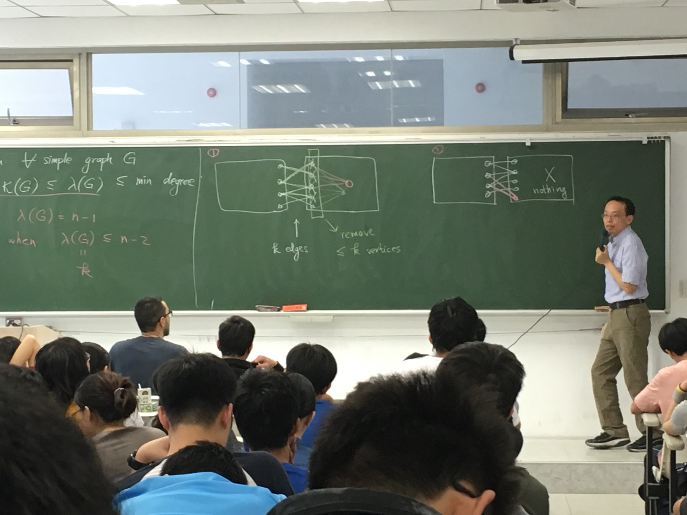

# Connectivity

# Def (Vertix/Edge Cut)

一張連通圖的 Vertex/edge Cut set of vertices/edges whose removal discouunects the grah。用：
$$
\kappa(G) = \min\{|\text{vertex cut}|\}
$$
以及：
$$
\lambda(G) = \min\{|\text{edge cut}|\}
$$

---

完全圖的 $\kappa$ 的定義是：
$$
\kappa(K_n) = n - 1
$$
因為每一張不完全圖，都有：
$$
\kappa(G) \leq n - 2
$$
暴力移開所有點就可以證明了。因此定義 $K_n$ 是完全圖再小一點。

---

## Thm

$$
\forall \text{simple graph G}.\kappa(G) \leq \lambda(G) \leq \text{min degree} \leq n-1
$$

---

只有第一個不等號有問題。

假定 $\lambda(G) = n - 1$，$G$ 是完全圖，因此顯然成立

