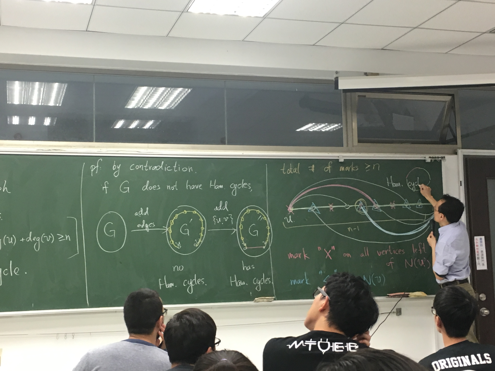

# 七橋問題

「有沒有一條路徑，遍歷所有邊？」

## Def (Euler Path / Cycle)

給定一張圖 $G = (V, E)$，若一個 path/cycle 恰經過所有邊 1 次，則該 path/cycle 稱作 Euler Path/Cycle。

### Thm

假定 $G = (V, E)$ 是張無向、連通的圖。則：
$$
G \text{ 有 Euler Cycle} \iff \forall v \in V.\deg(v) \text{ is even}
$$

---

「$\Rightarrow$」：

假定存在 Euler Cycle。對於任意 $v \in V$，因為路徑每通過一個節點都「有進有出」。因此，假定路徑通過節點 $k$ 次，因為 Euler Path 僅會經過相同的邊 1 次，故：
$$
\forall v \in V.\deg(v) = 2k
$$
由此得證。

「$\Leftarrow$」：構造性證明

1. 選任意一個節點開始，往任意一個邊走。最後走到不能再走時，一定會回到原點。
2. 移除掉剛剛的路徑。因為去掉的邊都只會減少偶數 degree，因此扣掉之後的圖，度數總和仍然是偶數 degree。
3. 重複 1, 2。直到分解不出新的圈。
4. 分解成很多圈之後，就可以逐一構造出 Euler Cycle

---

### Thm

假定 $G$ 是一張有向圖，則：
$$
G \text{ 有 Euler Path} \iff \text{恰有 0 或恰有 2 節個有奇數度數}
$$

---

「$\Leftarrow$」：

`CASE`：0 個奇數點

因為所有點都是偶數度數，依照前一個定理所有 Euler Cycle，因此就有 Euler Path。

`CASE`：2 個奇數度數點。

直覺來說就是那兩個奇數度數的點會當開頭或結束。因為最後不用回去。

假定那兩個度數為奇數的點是 $u$ 跟 $v$ 。證法就是 $\{u, v\}$ 加進邊裡面，令 $G' = (V, E \cup \{u,v\})$。因為這時後兩個點的度數都是「奇數 + 1」，也就是偶數，所以可知 $G'$ 有 Euler Cycle。這時把那條 Euler Cycle 中的 $\{u, v\}$ 邊剪開，就得到需要的 Euler Path。

「$\Rightarrow$」：

要嘛這是一個 Cycle，這時候由前一個定理知道所有點的度數是偶數; 而若這個路徑不是 Cycle，那麼顯然僅有起始點跟終點的度數是奇數（最後只有進或出），其他所有點度數都是偶數（有進有出），因此洽兩個點有

---

## Def (Hamiltonian Path / Cycle)

假定一個 path/cycle 經過一張圖的所有節點，則該 path/cycle 稱作 Hamiltonian path/cycle。

---

### Def (Bipartite Graph)

假定 $G = (V, E)$，且：
$$
\exists A, B. V = A \cup B\text{ and }A \cap B = \varnothing \text{ and }E \subseteq \{\{a, b\} \mid a \in A, b \in B\}
$$

---

### Observation

Bipartite Graph 的路徑，一定會是 ABABAB ... 交錯，或是 BABABA 交錯。

---

### Thm (有一國是奇數的 Bipartite Graph 走不完)

有一個集合的節點數為奇數的 Bipartite Graph 不存在 Hamiltonian Graph

---

因為一定要 ABABAB...交錯，因此有奇數點的話就回不去

所以如果圖可以湊成 bipartite graph，就可以用來輔助驗證。

---

### Def (Bipartite Complete Graph)

假定 $G = (V, E)$ 是一張 bipartite graph，並且 $V = A \cup B$，$A \cap B = \varnothing$。則 $K_{m, n}$ 定義為：
$$
|A| = m, |B| = n, K_{m,n} = \{\{a, b\} \mid \forall a \in A, b \in B\}
$$
---

就是連連看左邊每個點都連到右邊每個點的圖。

---

### Ore's Theorem

假定 $G$ 是一張「簡單」無向圖，且 $|V| \geq 3$ 。若：
$$
\forall u, v \in V. \{u, v\} \not \in E \Rightarrow \deg(u) + \deg(v) \geq n
$$
則 $G$ 有 Hamiltonian Path。

---

反證：假定 G 沒有。

假定 $G$ 透過某些增加某些邊可以變成有 Hamiltonian Path。假定 $G'$ 沒有 Hamiltonian Path，但加一個邊變成 $G''$ 時，產生了 Hamiltonian Path。

1. 每一個跟 $u$ 直接連接的點的左邊的節點，都記上紅色
2. 每個跟 $v$ 直接連接的點，都計上藍色
3. 因為 $\deg(u) + \deg(v) \geq n$，但 $u$ 一定不會被標到。所以 $n - 1$ 個點被總共被標了 $n$ 次，表示一定有點被重複標。用那個點構造出 $G'$ 的 Hamiltonian Graph，因此矛盾。所以這個 transition 永遠不會發生。因此一定有。

---

---

---

# Planar Graph

## Def (Planar Graph)

假定一張圖可以在平面上，沒有邊重疊的狀況下畫出來，則圖是平面圖。

---

$K_4$ 是平面圖。

$K_{3, 3}$ 不是平面圖。可以爆搜。

---

## Euler's Formula

對於任意「簡單」「平面」圖「畫法」，有：
$$
r = e - v + c + 1
$$
其中：
$$
\begin{cases}
r & \text{#of regions}\newline
v & \text{#of vertices} \newline
e & \text{#of edges} \newline
c & \text{#of components} \newline
\end{cases}
$$
---

使用歸納法：

==n = 0==：顯然成立

==n = k==

假定再加入一條邊 $\{u, v\}$，則：

Case 1：假定 u, v 在同一個 Connected Component，則增加這個邊時：
$$
\begin{cases}
r =r+1\newline
v = v \newline
e = e + 1 \newline
c = c
\end{cases}
$$
因此維持不變。

Cse2：假定他們在不同的 Component。這時：
$$
\begin{cases}
r =r\newline
v = v \newline
e = e + 1 \newline
c = c - 1
\end{cases}
$$
因此仍然維持。

證明的關鍵是因為：邊沒有重疊，所以可以確定 region 增加時只會有那幾種狀況。

---

## Thm

對於任意簡單平面圖畫法：
$$
\text{if }e > 2\text{ then }3r \leq 2e
$$

---

> Def (Degree of region)
> $$
> \deg(R) = \text{# of edges surrounding the region}
> $$
>

可以觀察：

$$
\sum \deg(R) = 2e
$$

因為每個邊內、外都被數到一次。因為除了外圍之外，要形成一個 Region，至少要有 3 個邊。因此：
$$
\underbrace{\sum \deg(R)}_{\leq 3r} = 2e
$$
故：
$$
3r \geq\sum \deg(R) = 2e
$$
這裡有一個小細節：如果只有 1 個邊，還是可以形成 region（就是最外圍那個）。不過，因為前面已經有說建立在 $e > 2$ 的前提之上了。

---

### Thm

對於任意平面圖（i.e. 只要有一種畫法是平面圖），則：
$$
e \leq 3v - 6
$$
因：
$$
e \geq \frac {3}{2}r
$$
以及 Euler's Formula：
$$
\frac {2}{3}e \geq r = e - v + c + 1 \geq e - v + 2 \Rightarrow e \leq 3v - 6
$$

得證。

---

### Corollary

$$
K_5 \text{ is not a planar graph}
$$

因為 $v = 5$。$e = 10$，$10 > 3 \cdot 5 - 6$。

---

### Corollary

任意簡單的平面圖：
$$
\exists v.\deg{v} \leq 5
$$

---

反證：假定這個點不存在，表示：
$$
\forall v_i \in V.\deg(v_i)\geq 6
$$
因此：
$$
\sum\deg(v_i)\geq 6 v
$$
但根據 Hand-Shaking Lemma：
$$
2e = \sum\deg(v_i)\geq 6 v
$$
與 Thm 矛盾。

---

## Sufficient Condition of Planar Graph

### Def (Subdivision o Graph)

---

### Thm 

Subdivision of a non-planar graph is also not a planar graph

---

### Thm (Kuratowski)

$$
G\text{ 是平面圖 } \iff \exists G' \subseteq G.G'\text{ is isomorphic to subdivision of }K_{3,3}\text{ or }K_5
$$

---

證明很長，所以沒有上。

---

# Graph Coloring

## Def (Coloring)

圖的「著色方式」是一個函數：
$$
f : V \to \text{colors}
$$
且 $f$ 滿足「相鄰的節點，顏色不同」。

---

## Def (Chromatic Number)

給定一個圖 $G$，$G$ 的 Chromatic Number, $\chi(G)$, 定義為「使圖合法著色的最少顏色」。

---

## Thm (平面圖 6 色可以上色)

任意平面圖 $G$：
$$
\chi (G) \leq 6
$$
---

對節點數目使用歸納法：

==v <= 6==：顯然成立

==v = k + 1> 6==

對於任意有 $k + 1 $ 個節點的平面圖，存在一個節點 $v$，使得 $v \leq 5$。

將 $v$ 以及其相鄰的邊移除。剩下的圖：

1. 因為有 $k$ 個節點，而且也是平面圖，因此有 6 色的著色法
2. 把邊裝回去，因為 $v$ 最多只有 5 個相鄰的邊，至少有一個顏色沒有用到。把 $v$ 著上剩下的顏色就好。