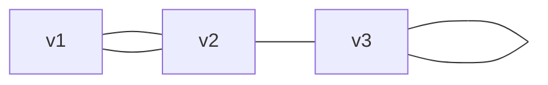

# Week 13

## Def (Undirected Graph)

一個無向圖是一個兩個集合組成的 pair：
$$
G = (V, E)
$$
其中：
$$
V = \{v_1, v_2 \dots v_n\}
$$
是所有節點形成的集合，而：
$$
E = \{e_1, e_2 \dots e_m\}
$$
是個 multiple set，表示所有邊的集合。
$$
e_i = \{v_j, v_k\} = \{v_k, v_k\}
$$
舉例：

