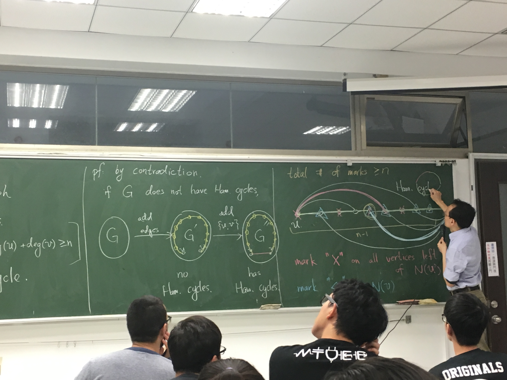

# Week 14

# 七橋問題

「有沒有一條路徑，遍歷所有邊？」

## Def (Euler Path / Cycle)

給定一張圖 $G = (V, E)$，若一個 path/cycle 恰經過所有邊 1 次，則該 path/cycle 稱作 Euler Path。

### Thm

假定 $G = (V, E)$ 是張無向、連通的圖。則：
$$
G \text{ 有 Euler Cycle} \iff \forall v \in V.\deg(v) \text{ is even}
$$

---

「$\Rightarrow$」：

假定存在 Euler Cycle。對於任意 $v \in V$，因為路徑每通過一個節點都「有進有出」。因此，假定路徑通過節點 $k$ 次，因為 Euler Path 僅會經過相同的邊 1 次，故：
$$
\forall v \in V.\deg(v) = 2k
$$
由此得證。

「$\Leftarrow$」：構造性證明

1. 選任意一個節點開始，往任意一個邊走。最後走到不能再走時，一定會回到原點。
2. 移除掉剛剛的路徑。因為去掉的邊都只會減少偶數 degree，因此扣掉之後的圖
3. 重複 1, 2。因為
4. 分解成很多圈之後，就可以逐一構造出 Euler Cycle

### Thm

假定 $G$ 是一張有向圖，則：
$$
G \text{ 有 Euler Path} \iff \text{恰有 0 或洽有 2 節個有基數度數}
$$

---

前者 (0) 給出的東西就是

直覺來說就是那兩個奇數度數的點會當開頭或結束。因為最後不用回去。

假定那兩個度數為奇數的點是 $u$ 跟 $v$ 。證法就是 $\{u, v\}$ 加進邊裡面，令 $G' = (V, E \cup \{u,v\})$，可知 $G'$ 有 Euler Cycle。這時把那條 Euler Cycle 中的 $\{u, v\}$ 邊剪開就好。

## Def (Hamiltonian Path / Cycle)

假定一個 path/cycle 經過一張圖的所有節點，則該 path/cycle 稱作 Hamiltonian path/cycle。

### Def (Bipartite Graph)

假定 $G = (V, E)$，且：
$$
\exists A, B. V = A \cup B\text{ and }A \cap B = \varnothing \text{ and }E \subseteq \{\{a, b\} \mid a \in A, b \in B\}
$$

### Thm (Bipartite Graph )

有一個集合的節點數為奇數的 Bipartite Graph 不存在 Hamiltonian Graph

pf：因為一定要 ABABAB...交錯，因此有奇數點的話就回不去

所以如果圖可以湊成 bipartite graph，就可以用來輔助驗證。

### Def (Bipartite Complete Graph)

假定 $G = (V, E)$ 是一張 bipartite graph，並且 $V = A \cup B$，$A \cap B = \varnothing$。則 $K_{m, n}$ 定義為：
$$
|A| = m, |B| = n, K_{m,n} = \{\{a, b\} \mid \forall a \in A, b \in B\}
$$
就是連連看左邊每個點都連到右邊每個點的圖。

### Ore's Theorem

假定 $G$ 是一張「簡單」無向圖，且 $|V| \geq 3$ 。若：
$$
\forall u, v \in V. \{u, v\} \not \in E \Rightarrow \deg(u) + \deg(v) \geq n
$$
則 $G$ 有 Hamiltonian Path。

反證：假定 G 沒有。

假定 $G$ 透過某些增加某些邊可以變成有 Hamiltonian Path。假定 $G'$ 沒有 Hamiltonian Path，但加一個邊變成 $G''$ 時，產生了 Hamiltonian Path。

1. 每一個跟 $u$ 直接連接的點的左邊的節點，都記上紅色
2. 每個跟 $v$ 直接連接的點，都計上藍色
3. 因為 $\deg(u) + \deg(v) \geq n$，但 $u$ 一定不會被標到。所以 $n - 1$ 個點被總共被標了 $n$ 次，表示一定有點被重複標。用那個點構造出 $G'$ 的 Hamiltonian Graph，因此矛盾。所以這個 transition 永遠不會發生。因此一定有。

# Planar Graph

## Def (Planar Graph)

假定一張圖可以在平面上，沒有邊重疊的狀況下畫出來，則圖是平面圖。

$K_4$ 是平面圖。

$K_{3, 3}$ 不是平面圖。可以爆搜。