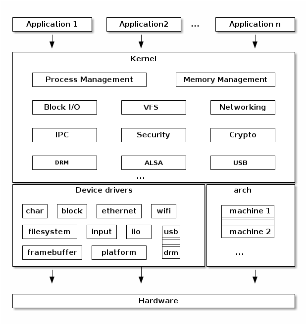
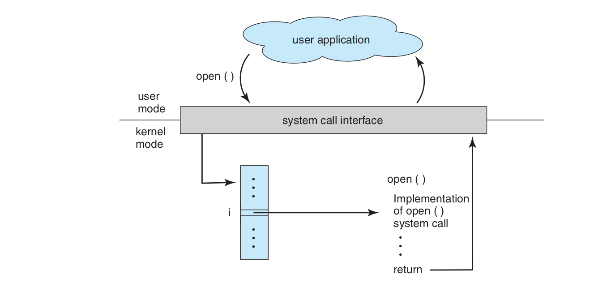
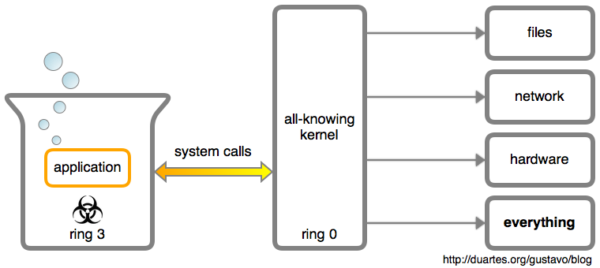
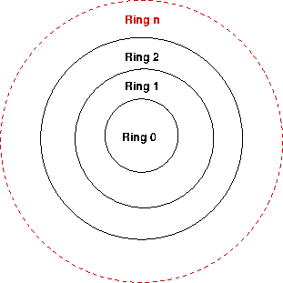

# Operating System Concept

作業系統提供一個抽象層，讓使用電腦的人可以在這個抽象化的概念上，對電腦進行使用，而不用擔心硬體上的不同。比如說，不管把 Linux 安裝在 Raspberry Pi (ARM 架構) 或是一般的家用電腦 (x86 架構)，Linux 中的依些概念，如 process, signal, IPC 等等，都是一樣的。使用者並不用擔心使用的是 ARM 或是 x86 架構。以 Linux 為例：



Linux 核心提供一個軟體跟硬體之間的中介，當使用者需要各種資源時，核心協助使用者做到。

# Operating System as Abstraction

使用者看到的這個只是一個作業系統提供抽象層，所以當使用者「以為自己做了什麼事情」時，實際上是「使用者跟作業系統要求做某件事，於是作業系統幫忙協調各種週邊硬體，完成使用者要求的任務後，把結果告訴使用者」。

比如說一個 hello, world 程式：

```c
#include <stdio.h>
int main() {
    printf("hello, world!");
}
```

使用者心種想的，是在 C 語言的標準輸出中，輸出 `hello, world!`。但在編譯之後，使用 `strace` 找出所有相關的系統呼叫，會出現：

```c
$ strace ./a.out 
execve("./a.out", ["./a.out"], 0x7ffe4c265820 /* 64 vars */) = 0
brk(NULL)                               = 0x5578568d6000
access("/etc/ld.so.nohwcap", F_OK)      = -1 ENOENT (No such file or directory)
access("/etc/ld.so.preload", R_OK)      = -1 ENOENT (No such file or directory)
openat(AT_FDCWD, "/etc/ld.so.cache", O_RDONLY|O_CLOEXEC) = 3
fstat(3, {st_mode=S_IFREG|0644, st_size=103518, ...}) = 0
mmap(NULL, 103518, PROT_READ, MAP_PRIVATE, 3, 0) = 0x7f1995c62000
close(3)                                = 0
access("/etc/ld.so.nohwcap", F_OK)      = -1 ENOENT (No such file or directory)
openat(AT_FDCWD, "/lib/x86_64-linux-gnu/libc.so.6", O_RDONLY|O_CLOEXEC) = 3
read(3, "\177ELF\2\1\1\3\0\0\0\0\0\0\0\0\3\0>\0\1\0\0\0\260A\2\0\0\0\0\0"..., 832) = 832
fstat(3, {st_mode=S_IFREG|0755, st_size=1996592, ...}) = 0
mmap(NULL, 8192, PROT_READ|PROT_WRITE, MAP_PRIVATE|MAP_ANONYMOUS, -1, 0) = 0x7f1995c60000
mmap(NULL, 2004992, PROT_READ, MAP_PRIVATE|MAP_DENYWRITE, 3, 0) = 0x7f1995a76000
mprotect(0x7f1995a98000, 1826816, PROT_NONE) = 0
mmap(0x7f1995a98000, 1511424, PROT_READ|PROT_EXEC, MAP_PRIVATE|MAP_FIXED|MAP_DENYWRITE, 3, 0x22000) = 0x7f1995a98000
mmap(0x7f1995c09000, 311296, PROT_READ, MAP_PRIVATE|MAP_FIXED|MAP_DENYWRITE, 3, 0x193000) = 0x7f1995c09000
mmap(0x7f1995c56000, 24576, PROT_READ|PROT_WRITE, MAP_PRIVATE|MAP_FIXED|MAP_DENYWRITE, 3, 0x1df000) = 0x7f1995c56000
mmap(0x7f1995c5c000, 14336, PROT_READ|PROT_WRITE, MAP_PRIVATE|MAP_FIXED|MAP_ANONYMOUS, -1, 0) = 0x7f1995c5c000
close(3)                                = 0
arch_prctl(ARCH_SET_FS, 0x7f1995c61500) = 0
mprotect(0x7f1995c56000, 16384, PROT_READ) = 0
mprotect(0x557855d77000, 4096, PROT_READ) = 0
mprotect(0x7f1995ca5000, 4096, PROT_READ) = 0
munmap(0x7f1995c62000, 103518)          = 0
fstat(1, {st_mode=S_IFCHR|0620, st_rdev=makedev(136, 0), ...}) = 0
brk(NULL)                               = 0x5578568d6000
brk(0x5578568f7000)                     = 0x5578568f7000
write(1, "hello, world!", 13hello, world!)           = 13
exit_group(0)                           = ?
+++ exited with 0 +++

```

也就是說，為了做到使用者「呼叫 `printf` 就是印出東西」的想像，作業系統需要在使用者背後做一些使用者看不到的工作。而使用者只要知道「呼叫 `printf` 可以印出東西」就好，不用擔心到底要做什麼，才能讓螢幕顯示出東西。

這個道理有點像是銀行櫃台：需要什麼服務時，會先去櫃台請求服務，銀行人員依照狀況印出一堆從來沒有人知道是什麼的東西叫你簽名。從頭到尾都只要只到銀行有窗口可以提供這個服務，不用知道那些服務背後到底有什麼業務上的細節，也不用親自去處理這些細節。

# User vs. Kernel

## 軟體視角：User Space 跟 Kernel Space 

上面的例子可以知道，當使用者在執行程式時，實際上電腦有時候會處理使用者的程式，而有時候會執行那些「使用者向作業系統請求協助後，作業系統要做的事」。電腦的狀態如果是在處理前者，就稱做處在「User Mode」，而若是正在處理後者，則稱處在「Kernel Mode」。



而「請作業系統幫忙做事情」這件事情稱做「系統呼叫」。比如說呼叫 `pthread_creat`e  可以叫作業系統給我一條執行緒。當然這個執行緒只要我用起來像是條執行續就好，至於 kernel 裡面到底怎麼做到的，使用者不用去注意。

以 Linux 為例，系統呼叫通常都有 C 語言的介面。比如說最簡單的 `write`:

```C
WRITE(2)                   Linux Programmer's Manual                  WRITE(2)

NAME
       write - write to a file descriptor

SYNOPSIS
       #include <unistd.h>

       ssize_t write(int fd, const void *buf, size_t count);

DESCRIPTION
       write() writes up to count bytes from the buffer starting at buf to the
       file referred to by the file descriptor fd.
```

在使用作業系統需要的系統呼叫時，看到的狀況大概是這樣的：

1. 當使用者程式需要週邊的硬體資源時，就給作業系統一個請求，並且將硬體資源讓給 kernel 使用
2. kernel 依照使用者需求提供需要的服務。
3. kernel 處理完畢之後，把硬體資源還給 user



也就是說，當程式需要硬體資源時，並不是自己直接跟硬體溝通，而是向作業系統請求。這個請求就是所謂的系統呼叫。

## 硬體視角：Previleges 切換

就硬體的角度來看，系統呼叫牽涉到「權限的切換」。當使用者需要系統呼叫時，會~~按下紅色按鈕~~執行特定的指令。CPU 執行到這個指令時，會先儲存上下文，並且切換到較高的權限，且 instruction pointer 跳到執行 kernel 程式的進入點（即 kernel entry point），開始執行 kernel 內部的程式，這個就是「進入 kernel space」在硬體上看起來的樣子。

以 x86 為例，可以透過 `syscall` 指令進入系統呼叫：

```assembly
.data
msg:
    .ascii "Hello, world!\n"
    len = . - msg
.text
    .global _start

_start:
    movq  $1, %rax
    movq  $1, %rdi
    movq  $msg, %rsi
    movq  $len, %rdx
    syscall

    movq  $60, %rax
    xorq  %rdi, %rdi
    syscall
```

而 x86 處理器中的權限劃分大致如下：




x86 處理器中的權限是用 `ring n` 作為依據，`n` 愈小，權限愈大。作業系統執行在 ring 0 權限，而 user program 執行在 ring 3 權限。注意 0 並不是最高的權限，比如虛擬機器的 hyperviser 可以有權限 -1。權限愈高的狀態，能存取的資源愈多。如果 CPU 處在較低的權限，卻要存取較高權限的資源，就會觸發例外或中斷等狀況。

那在執行系統呼叫的時候，到底做了什麼呢？其實跟 function call 大同小異，只是多了一點細節：


1. 放好變數：跟 function call 類似，把變數塞到對應的暫存器中。
2. 跳到 kernel 裡面，執行相關程式：保存必要的上下文，並且跳轉到 kernel 相關程式的進入點。所謂==「跳到 kernel 裡面」實際上是指「CPU 模式切換到權限較高的地方，並執行 kernel 中處理系統呼叫相關的程式==。這件事通常會有專門的指令，比如說 `syscall`, `sysenter` 等等。這也是 System Call 跟 Function Call 的一個差異之一。有些用語會說「user 將 CPU 轉交給 kernel」這類的用語，實際上指的是這件事。
3. 執行結束後，回到 user space：把結果存在對應的暫存器 (比如說 `rax`) 後，恢復上下文，模式回到權限較低的模式，並且跳回使用者執行的程式內容。

這種「使用者要先通知 kernel，kernel 作為中間人幫使用者做事」的機制又稱做「call gate」。

# 實驗：syscall 函數

這個小試驗主要是在找 Linux 下有哪些系統呼叫，並且觀察 `syscall` 指令再那邊出現。

在 Linux 的系統呼叫中，根據[System V Application Binary Interface](http://refspecs.linuxfoundation.org/elf/x86_64-abi-0.99.pdf)，系統呼叫的規定如下：

> > 1. User-level applications use as integer registers for passing the   sequence   `%rdi`, `%rsi`, `%rdx`, `%rcx`,   `%r8` and `%r9`. **The kernel interface uses %rdi,    %rsi, %rdx, %r10, %r8 and %r9.**
> > 2. A system-call is done via the **syscall instruction**.  This clobbers %rcx and %r11, as well as %rax, but other registers are preserved.
> > 3. The number of the syscall has to be passed in register %rax.
> > 4. System-calls are limited to six arguments, no argument is passed   directly on the stack.
> > 5. Returning from the syscall, register %rax contains the result of   the system-call. A value in the range between -4095 and -1 indicates   an error,  it is `-errno`.
> > 6. Only values of class INTEGER or class MEMORY are passed to the kernel.

## syscall 函數

在 Linux 中，有一個 `syscall` 函數，可以進行系統呼叫：

```c
SYSCALL(2)                 Linux Programmer's Manual                SYSCALL(2)

NAME
       syscall - indirect system call

SYNOPSIS
       #define _GNU_SOURCE         /* See feature_test_macros(7) */
       #include <unistd.h>
       #include <sys/syscall.h>   /* For SYS_xxx definitions */

       long syscall(long number, ...);

DESCRIPTION
       syscall()  is  a  small  library  function that invokes the system call
       whose assembly language interface has the  specified  number  with  the
       specified  arguments.  Employing syscall() is useful, for example, when
       invoking a system call that has no wrapper function in the C library.

       syscall() saves CPU registers before making the system  call,  restores
       the  registers  upon  return from the system call, and stores any error
       code returned by the system call in errno(3) if an error occurs.

       Symbolic constants for system call numbers can be found in  the  header
       file <sys/syscall.h>.
```

從 `man` 裡面可以知道：系統呼叫的編號定義再 `sys/syscall.h` 這個 header 裡面。但要找到這東西在哪邊，會經歷一些波折。因為在 `/usr/include/sys/syscall.h` 中，會看到的內容是：

```c
#ifndef _SYSCALL_H
#define _SYSCALL_H      1

/* This file should list the numbers of the system calls the system knows.
   But instead of duplicating this we use the information available
   from the kernel sources.  */
#include <asm/unistd.h>

#ifndef _LIBC
/* The Linux kernel header file defines macros `__NR_<name>', but some
   programs expect the traditional form `SYS_<name>'.  So in building libc
   we scan the kernel's list and produce <bits/syscall.h> with macros for
   all the `SYS_' names.  */
# include <bits/syscall.h>
#endif
#endif
```

然後當你以為在 `/usr/include/asm/unistd.h` 中會找到他實，打開一看發現：

```c
/* SPDX-License-Identifier: GPL-2.0 WITH Linux-syscall-note */
#ifndef _ASM_X86_UNISTD_H
#define _ASM_X86_UNISTD_H

/* x32 syscall flag bit */
#define __X32_SYSCALL_BIT       0x40000000

# ifdef __i386__
#  include <asm/unistd_32.h>
# elif defined(__ILP32__)
#  include <asm/unistd_x32.h>
# else
#  include <asm/unistd_64.h>
# endif

#endif /* _ASM_X86_UNISTD_H */
```

直到照程內容打開 `/usr/include/asm/unistd_64.h` 時，你才會找到：

```c
#ifndef _ASM_X86_UNISTD_64_H
#define _ASM_X86_UNISTD_64_H 1

#define __NR_read 0
#define __NR_write 1
#define __NR_open 2
#define __NR_close 3
#define __NR_stat 4
#define __NR_fstat 5
#define __NR_lstat 6
#define __NR_poll 7
#define __NR_lseek 8
#define __NR_mmap 9
#define __NR_mprotect 10
#define __NR_munmap 11
#define __NR_brk 12
#define __NR_rt_sigaction 13
#define __NR_rt_sigprocmask 14
#define __NR_rt_sigreturn 15
#define __NR_ioctl 16
#define __NR_pread64 17
...
```

比如說下面這個程式：

```c
#include <sys/syscall.h>
#include <unistd.h>
int main() {
    syscall(__NR_write, 1, "hello, world!", 14);
}
```

使用 `gcc -static` 編譯，並使用 `objdump -D` 之後，檢視 `<main>` 中的內容：

```assembly
0000000000401b6d <main>:
  401b6d:       55                      push   %rbp
  401b6e:       48 89 e5                mov    %rsp,%rbp
  401b71:       b9 0e 00 00 00          mov    $0xe,%ecx
  401b76:       48 8d 15 87 d4 08 00    lea    0x8d487(%rip),%rdx        # 48f004 <_IO_stdin_used+0x4>
  401b7d:       be 01 00 00 00          mov    $0x1,%esi
  401b82:       bf 01 00 00 00          mov    $0x1,%edi
  401b87:       b8 00 00 00 00          mov    $0x0,%eax
  401b8c:       e8 3f 59 04 00          callq  4474d0 <syscall>
  401b91:       b8 00 00 00 00          mov    $0x0,%eax
  401b96:       5d                      pop    %rbp
  401b97:       c3                      retq
  401b98:       0f 1f 84 00 00 00 00    nopl   0x0(%rax,%rax,1)
  401b9f:       00
```

依照提示，檢查呼叫 `syscall` 的部份：

```assembly
0000000004474d0 <syscall>:
  4474d0:       48 89 f8                mov    %rdi,%rax
  4474d3:       48 89 f7                mov    %rsi,%rdi
  4474d6:       48 89 d6                mov    %rdx,%rsi
  4474d9:       48 89 ca                mov    %rcx,%rdx
  4474dc:       4d 89 c2                mov    %r8,%r10
  4474df:       4d 89 c8                mov    %r9,%r8
  4474e2:       4c 8b 4c 24 08          mov    0x8(%rsp),%r9
  4474e7:       0f 05                   syscall
  4474e9:       48 3d 01 f0 ff ff       cmp    $0xfffffffffffff001,%rax
  4474ef:       73 01                   jae    4474f2 <syscall+0x22>
  4474f1:       c3                      retq
  4474f2:       48 c7 c1 c0 ff ff ff    mov    $0xffffffffffffffc0,%rcx
  4474f9:       f7 d8                   neg    %eax
  4474fb:       64 89 01                mov    %eax,%fs:(%rcx)
  4474fe:       48 83 c8 ff             or     $0xffffffffffffffff,%rax
  447502:       c3                      retq
  447503:       66 2e 0f 1f 84 00 00    nopw   %cs:0x0(%rax,%rax,1)
  44750a:       00 00 00
  44750d:       0f 1f 00                nopl   (%rax)
```

可以發現

## 一些細節

如果想要直接用 `objdump` 去找到底哪裡用了 `syscall` 的話，會碰到一個有點尷尬的狀況。比如說以下這個程式：

```c
#include <stdio.h>
int main() {
    printf("hello, world!");
}
```

### 狀況一：編譯器優化

首先，上面這個程式如果直接編譯的話，有可能會跑出下面至個結果：

```assembly
0000000000001135 <main>:
    1135:       55                      push   %rbp
    1136:       48 89 e5                mov    %rsp,%rbp
    1139:       48 8d 3d c4 0e 00 00    lea    0xec4(%rip),%rdi        # 2004 <_IO_stdin_used+0x4>
    1140:       e8 eb fe ff ff          callq  1030 <puts@plt>
    1145:       b8 00 00 00 00          mov    $0x0,%eax
    114a:       5d                      pop    %rbp
    114b:       c3                      retq
    114c:       0f 1f 40 00             nopl   0x0(%rax)
```

會發現對應呼叫的函數是 `puts@plt`。之所以不是 `printf` 是因為 `printf` 是個很肥的函數，而這邊印出的字串是個 constant，所以編譯器把他用 `puts` 代替 。

### 狀況二：沒有靜態編譯

如果沒有靜態編譯的話，那麼會發現 `<main> `裡面的東西長成這樣：

```assembly
0000000000001135 <main>:
    1135:       55                      push   %rbp
    1136:       48 89 e5                mov    %rsp,%rbp
    1139:       48 8d 3d c4 0e 00 00    lea    0xec4(%rip),%rdi        # 2004 <_IO_stdin_used+0x4>
    1140:       b8 00 00 00 00          mov    $0x0,%eax
    1145:       e8 e6 fe ff ff          callq  1030 <printf@plt>
    114a:       b8 00 00 00 00          mov    $0x0,%eax
    114f:       5d                      pop    %rbp
    1150:       c3                      retq
    1151:       66 2e 0f 1f 84 00 00    nopw   %cs:0x0(%rax,%rax,1)
    1158:       00 00 00
    115b:       0f 1f 44 00 00          nopl   0x0(%rax,%rax,1)
```

真正有差的地方是那個 `<printf@plt>`。如果去找程式中的那個區段，會發現只有 3 行：

```assembly
0000000000001030 <printf@plt>:
    1030:       ff 25 9a 2f 00 00       jmpq   *0x2f9a(%rip)        # 3fd0 <printf@GLIBC_2.2.5>
    1036:       68 00 00 00 00          pushq  $0x0
    103b:       e9 e0 ff ff ff          jmpq   1020 <.plt>
```

就發現這三行怎麼看都不是 `printf` 阿！這是因為如果沒有靜態編譯的話，就需要等 linker 把函數對應的位置告訴程式之後，才會知道跳到那邊執行那個函數。所以到這邊當然不會有 `puts` 的內容。

### 狀況三：你找 ~ 不 ~ 到

使用靜態編譯之後：

```shell
$ gcc hello.c -static -o hello
$ objdump -D hello
```

在 `<main>` 區段中，會出現：

```assembly
0000000000401b6d <main>:
  401b6d:       55                      push   %rbp
  401b6e:       48 89 e5                mov    %rsp,%rbp
  401b71:       48 8d 3d 8c d4 08 00    lea    0x8d48c(%rip),%rdi        # 48f004 <_IO_stdin_used+0x4>
  401b78:       b8 00 00 00 00          mov    $0x0,%eax
  401b7d:       e8 ce e7 00 00          callq  410350 <_IO_printf>
  401b82:       b8 00 00 00 00          mov    $0x0,%eax
  401b87:       5d                      pop    %rbp
  401b88:       c3                      retq
  401b89:       0f 1f 80 00 00 00 00    nopl   0x0(%rax)
```

跳到 `<_IO_printf>` 中，檢視：

```assembly
0000000000410350 <_IO_printf>:
  410350:       48 81 ec d8 00 00 00    sub    $0xd8,%rsp
  410357:       48 89 74 24 28          mov    %rsi,0x28(%rsp)
  41035c:       48 89 54 24 30          mov    %rdx,0x30(%rsp)
  410361:       48 89 4c 24 38          mov    %rcx,0x38(%rsp)
  410366:       4c 89 44 24 40          mov    %r8,0x40(%rsp)
  41036b:       4c 89 4c 24 48          mov    %r9,0x48(%rsp)
  410370:       84 c0                   test   %al,%al
  410372:       74 37                   je     4103ab <_IO_printf+0x5b>
  410374:       0f 29 44 24 50          movaps %xmm0,0x50(%rsp)
  410379:       0f 29 4c 24 60          movaps %xmm1,0x60(%rsp)
  41037e:       0f 29 54 24 70          movaps %xmm2,0x70(%rsp)
  410383:       0f 29 9c 24 80 00 00    movaps %xmm3,0x80(%rsp)
  41038a:       00
  41038b:       0f 29 a4 24 90 00 00    movaps %xmm4,0x90(%rsp)
  410392:       00
  410393:       0f 29 ac 24 a0 00 00    movaps %xmm5,0xa0(%rsp)
  41039a:       00
  41039b:       0f 29 b4 24 b0 00 00    movaps %xmm6,0xb0(%rsp)
  4103a2:       00
  4103a3:       0f 29 bc 24 c0 00 00    movaps %xmm7,0xc0(%rsp)
  4103aa:       00
  4103ab:       64 48 8b 04 25 28 00    mov    %fs:0x28,%rax
  4103b2:       00 00
  4103b4:       48 89 44 24 18          mov    %rax,0x18(%rsp)
  4103b9:       31 c0                   xor    %eax,%eax
  4103bb:       48 89 fe                mov    %rdi,%rsi
  4103be:       48 8d 84 24 e0 00 00    lea    0xe0(%rsp),%rax
  4103c5:       00
  4103c6:       48 89 e2                mov    %rsp,%rdx
  4103c9:       48 8b 3d d0 73 0a 00    mov    0xa73d0(%rip),%rdi        # 4b77a0 <_IO_stdout>
  4103d0:       48 89 44 24 08          mov    %rax,0x8(%rsp)
  4103d5:       48 8d 44 24 20          lea    0x20(%rsp),%rax
  4103da:       c7 04 24 08 00 00 00    movl   $0x8,(%rsp)
  4103e1:       c7 44 24 04 30 00 00    movl   $0x30,0x4(%rsp)
  4103e8:       00
  4103e9:       48 89 44 24 10          mov    %rax,0x10(%rsp)
  4103ee:       e8 5d c9 04 00          callq  45cd50 <_IO_vfprintf>
  4103f3:       48 8b 4c 24 18          mov    0x18(%rsp),%rcx
  4103f8:       64 48 33 0c 25 28 00    xor    %fs:0x28,%rcx
  4103ff:       00 00
  410401:       75 08                   jne    41040b <_IO_printf+0xbb>
  410403:       48 81 c4 d8 00 00 00    add    $0xd8,%rsp
  41040a:       c3                      retq
  41040b:       e8 40 9a 03 00          callq  449e50 <__stack_chk_fail>
```

可以發現還是要到散落各地的函式們去一一尋找。

